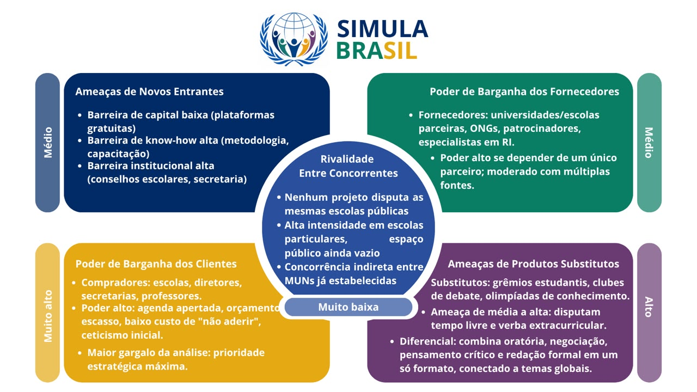
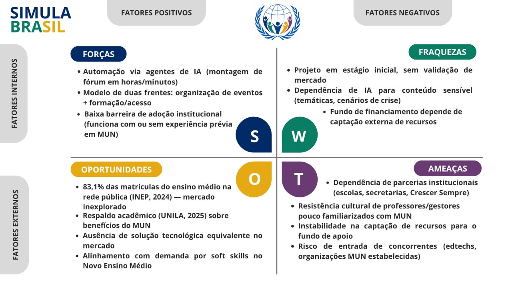
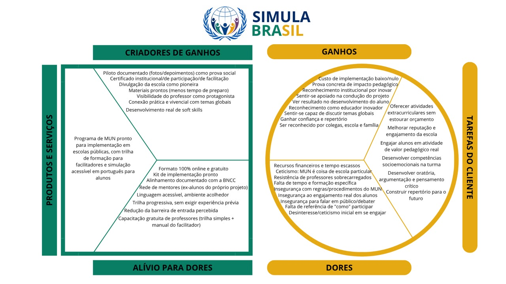
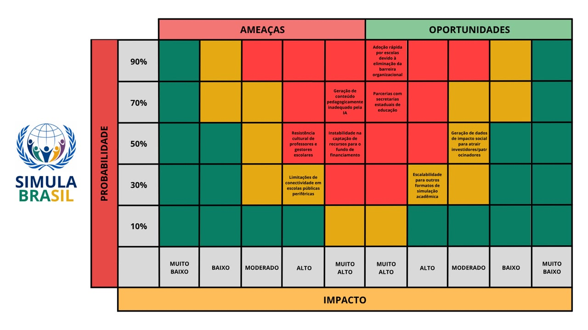

# WAD - Web Application Document

## Simula Brasil

**Autores:**
[Ademir Antônio dos Santos Júnior](https://www.linkedin.com/in/ademir-junior-9ba005357/)

[Igor da Silva Rodrigues](https://www.linkedin.com/in/igor-dasilva-rodrigues/)

[Julia Jesus Bezerra](https://www.linkedin.com/in/julia-jesus-bezerra-a872b5321/)

## Sumário

[1. Introdução](#c1)

[2. Visão Geral da Aplicação Web](#c2)

[3. Projeto Técnico da Aplicação Web](#c3)

[4. Desenvolvimento da Aplicação Web](#c4)

[5. Testes da Aplicação Web](#c5)

[6. Estudo de Mercado e Plano de Marketing](#c6)

[7. Conclusões e trabalhos futuros](#c7)

[8. Referências](#c8)

<br>


# <a name="c1"></a>1. Introdução

No Brasil, garantir que estudantes de escolas públicas desenvolvam soft skills e hard skills importantes, como trabalhar em grupo, pensar criticamente, falar em público e defender opiniões, ainda é um grande desafio. As simulações da ONU (MUN) estão entre as experiências mais eficazes para desenvolver essas competências, pesquisa da UNILA (2025) aponta que a participação em MUNs aprimora oratória, negociação e pensamento crítico, além de aprofundar a compreensão das relações internacionais.¹

O problema é que esse tipo de oportunidade não chega à maior parte dos estudantes brasileiros. As simulações seguem concentradas em colégios particulares e faculdades, com inscrições que podem custar de R$100 a mais de R$1.000 por participante, o que inviabiliza a participação de alunos de baixa renda, muitos dos quais nem sabem que esse universo existe.² A barreira fica ainda mais evidente diante da escala da rede pública, segundo o Censo Escolar 2024 (INEP), 83,1% das matrículas do ensino médio estão na rede estadual pública.³ São justamente esses estudantes que as simulações hoje praticamente não alcançam. E, para quem organiza, há um segundo obstáculo: estruturar um fórum exige de semanas a meses de planejamento intensivo, inviabilizando o evento mesmo onde há vontade institucional.

Nesse contexto, propomos o Simula Brasil, projeto que tem como objetivo fomentar o desenvolvimento de alunos periféricos por meio das simulações da ONU. A solução reúne diferentes sites e funcionalidades em torno de um mesmo propósito: democratizar o acesso ao universo MUN.
A primeira frente é uma aplicação web que automatiza toda a estrutura organizacional de uma simulação, reduzindo um processo de semanas ou meses para poucas horas ou minutos com montagem automática do fórum, distribuição inteligente de países e comitês, geração de temáticas e cenários de crise por agentes de IA, formação de diretorias. O diferencial está no uso de agentes de inteligência artificial, que executam em minutos o que hoje demanda equipes inteiras.
A segunda frente é uma plataforma voltada à formação e ao acesso de estudantes de baixa renda, reunindo conteúdo educacional, agenda de eventos, um fundo de financiamento para alunos em vulnerabilidade e a inscrição institucional em eventos parceiros.

Além de reduzir drasticamente o tempo e o esforço de organização, a solução torna viável que qualquer escola, pública ou privada, com ou sem experiência prévia em MUN, realize seu próprio fórum, ao mesmo tempo em que oferece a estudantes de baixa renda o preparo e o acesso necessários para participar. Dessa forma, o Simula Brasil busca romper a barreira que hoje restringe as simulações da ONU à elite, ampliando o alcance de uma formação que desenvolve pensamento crítico, oratória e cidadania justamente entre os jovens que mais têm a ganhar com ela.

# <a name="c2"></a>

## 2. Visão Geral da Aplicação Web

## 2.1. Escopo do Projeto

### 2.1.1. Modelo de 5 Forças de Porter

O Modelo das 5 Forças de Porter é uma ferramenta de gestão criada por Michael Porter com o objetivo de analisar o ambiente competitivo de um mercado. O modelo se estrutura em cinco pilares que permitem identificar oportunidades e ameaças em um determinado setor: a rivalidade entre concorrentes diretos, a ameaça de novos entrantes, a ameaça de produtos ou serviços substitutos, o poder de barganha dos clientes e o poder de barganha dos fornecedores. Embora originalmente concebido para maximizar lucro em ambientes empresariais, o modelo se mostra igualmente útil como ferramenta de diagnóstico estratégico para projetos sociais e educacionais.

## Contexto da análise

O projeto Simula Brasil atua no espaço das simulações de Modelo das Nações Unidas (MUN) como ferramenta de formação cidadã. Seu propósito central é levar esse formato — hoje concentrado quase exclusivamente em escolas particulares e universidades — para escolas públicas, de forma acessível e democrática.

<div align="center">
  <sub>Figura 1 — Modelo de 5 Forças de Porter</sub><br>
  <br>
  <sup>Fonte:Simula Brasil, 2026.</sup>
</div>

---

## 1. Análise da rivalidade entre concorrentes existentes

No eixo estrito de mercado, a rivalidade é praticamente nula: atualmente não existem projetos disputando as mesmas escolas ou os mesmos alunos que o Simula Brasil busca atender. Ao se ampliar o olhar para além da disputa direta por clientela, no entanto, é possível identificar concorrentes indiretos: os circuitos de MUN já estabelecidos, como os organizados por universidades, escolas particulares e eventos pagos com taxas de inscrição elevadas.

Essa rivalidade se manifesta com alta intensidade em grandes centros urbanos e entre escolas particulares, que frequentemente disputam prestígio por meio da participação em MUNs de renome. Entre as escolas públicas, porém, essa disputa é baixa ou praticamente inexistente — o que caracteriza o espaço em que o Simula Brasil pretende atuar como um território ainda vazio.

**Classificação:** Baixa

---

## 2. Poder de barganha dos fornecedores

Os fornecedores do projeto são, principalmente, universidades e escolas parceiras — que cedem espaço físico e alunos com experiência na proposta —, ONGs de educação, possíveis patrocinadores financeiros e especialistas em relações internacionais que contribuem com palestras e validação de conteúdo.

O poder de negociação desses fornecedores é alto quando o projeto depende de um único parceiro, gerando vulnerabilidade em caso de retirada desse apoio. Esse poder se torna moderado quando existem múltiplas fontes alternativas de voluntários e recursos.

Como implicação estratégica, recomenda-se a criação de um banco interno de facilitadores treinados, no qual ex-alunos do próprio Simula Brasil se formam e passam a atuar como mentores das edições seguintes — reduzindo, assim, a dependência de fornecedores externos ao longo do tempo.

**Classificação:** Moderada

---

## 3. Poder de barganha dos clientes

Os compradores, neste contexto, são as escolas, diretores e coordenadores pedagógicos, secretarias de educação e professores que decidem abraçar o projeto.

Esse poder é alto por diversos motivos: as escolas públicas possuem agenda curricular apertada e já disputam tempo com outros programas, como feiras de ciências; os recursos são escassos, e qualquer projeto que exija custo extra enfrenta resistência natural; o custo de "não aderir" é baixo, já que, se o projeto não convencer, a escola simplesmente o ignora e segue com suas atividades habituais; e há um ceticismo inicial por parte dos gestores, muitas vezes expresso em falas como "MUN é coisa de escola particular".

Diante disso, a implicação estratégica é reduzir ao máximo o custo de adesão — por meio de formato 100% online e treinamento gratuito de professores — e conduzir um piloto bem documentado, com fotos e depoimentos de alunos que sirvam de prova social para convencer novas escolas.

**Classificação:** Alta

---

## 4. Ameaça de novos entrantes

As barreiras de entrada nesse setor apresentam naturezas distintas. Em termos de capital financeiro, a barreira é baixa: não é necessário investimento robusto, já que plataformas gratuitas como Google Meet e Discord viabilizam a realização das simulações.

Já em termos de know-how, a barreira é alta, pois a execução de um MUN de qualidade exige metodologia pedagógica consolidada, capacitação de professores e domínio das regras de procedimento das simulações.

A barreira também é alta no aspecto institucional: para ingressar na rede de escolas públicas, é necessário passar pelo crivo de secretarias de educação, diretores e conselhos escolares — um processo burocrático que, na prática, funciona como proteção natural contra entrantes despreparados.

Como implicação estratégica, recomenda-se documentar e padronizar a metodologia do projeto, de forma a criar uma marca de qualidade difícil de ser replicada rapidamente por terceiros. Também é estratégico buscar reconhecimento oficial junto a uma secretaria de educação e formar uma rede própria de facilitadores certificados, consolidando uma vantagem competitiva sustentável.

**Classificação:** Moderada

---

## 5. Ameaça de produtos substitutos

Os principais substitutos identificados são os grêmios estudantis, os clubes de debate e oratória e as olimpíadas de conhecimento.

A ameaça representada por esses substitutos é de média a alta intensidade, uma vez que todas essas atividades disputam o mesmo recurso escasso: o tempo livre e a atenção do aluno, além da verba e do espaço destinados a atividades extracurriculares na escola.

O diferencial competitivo das simulações de MUN, no entanto, está em sua capacidade de combinar simultaneamente oratória, negociação diplomática, pensamento crítico sobre política internacional, redação formal e trabalho em equipe. Além disso, o formato conecta o aluno a temas globais de maneira prática e vivencial, algo que nenhum dos substitutos citados oferece de forma tão integrada.

**Classificação:** Média a Alta

---
## Conclusão

A análise das cinco forças revela que o maior gargalo do projeto está no poder de negociação dos compradores — ou seja, das próprias escolas públicas —, cuja intensidade, neste contexto, é alta.

Por essa razão, a prioridade de ação deve ser máxima nessa frente, concentrando esforços em reduzir o custo de adesão das escolas e em comprovar, de forma consistente e documentada, o impacto real do projeto Simula Brasil.

### 2.1.2. Análise SWOT

A análise SWOT foi elaborada considerando o posicionamento do Simula Brasil no contexto da educação pública brasileira e do universo das simulações da ONU (MUN), um cenário marcado por forte desigualdade de acesso, baixa penetração de tecnologia na organização de eventos educacionais e crescente demanda por soft skills como pensamento crítico, oratória e negociação. A avaliação contempla fatores internos relativos à proposta de valor, à arquitetura tecnológica e à equipe do projeto, bem como fatores externos vinculados ao cenário educacional público, às barreiras financeiras dos estudantes e à ausência de concorrência direta no segmento. 

<div align="center">
  <sub>Figura 2 — Análise SWOT</sub><br>
  <br>
  <sup>Fonte: Autores, 2026.</sup>
</div>

**Forças (Ambiente interno)**

O principal diferencial do Simula Brasil está no uso de agentes de inteligência artificial para automatizar a montagem de fóruns MUN, reduzindo um processo que hoje leva semanas ou meses de planejamento intensivo para poucas horas ou minutos, incluindo distribuição de países e comitês, geração de temáticas e cenários de crise, e formação de diretorias. Essa automação representa uma vantagem competitiva difícil de replicar manualmente. Outro ponto forte é o modelo de duas frentes complementares: a aplicação de organização de fóruns e a plataforma de formação e acesso para estudantes de baixa renda, o que amplia o impacto do projeto para além da simples tecnologia, atacando também o problema de letramento sobre o universo MUN. A proposta ainda conta com baixa barreira de adoção institucional, pois permite que qualquer escola, com ou sem experiência prévia em simulações, organize seu próprio evento.

**Fraquezas (Ambiente interno)**

Como projeto em estágio inicial, o Simula Brasil enfrenta a ausência de histórico e validação de mercado, o que pode gerar resistência de escolas e instituições parceiras na adoção de uma ferramenta ainda não testada em larga escala. A dependência de agentes de IA para geração de conteúdo sensível (temáticas, cenários de crise, distribuição de comitês) exige validação pedagógica cuidadosa, já que erros de geração podem comprometer a credibilidade do produto perante educadores. Além disso, a proposta inclui um fundo de financiamento para alunos em vulnerabilidade, o que introduz uma dependência de captação de recursos externos (parcerias, patrocínios ou doações) que foge do controle direto do produto tecnológico e pode limitar a escalabilidade dessa frente caso o financiamento não seja sustentável.

**Oportunidades (Ambiente externo)**

O contexto atual é altamente favorável: segundo o Censo Escolar 2024 (INEP), 83,1% das matrículas do ensino médio estão na rede estadual pública.<sup>[1](#ref1)</sup> , evidenciando um mercado praticamente inexplorado para simulações da ONU, hoje concentradas em colégios particulares e faculdades. A pesquisa da UNILA (2025) reforça a legitimidade pedagógica da proposta, ao demonstrar que a participação em MUNs aprimora oratória, negociação e pensamento crítico <sup>[2](#ref2)</sup> , o que facilita o discurso institucional junto a secretarias de educação e escolas públicas. Some-se a isso a crescente pressão por desenvolvimento de competências socioemocionais (soft skills) na educação básica brasileira, alinhada a políticas públicas e ao próprio Novo Ensino Médio. A ausência de uma solução tecnológica equivalente no mercado brasileiro representa uma janela de pioneirismo para o Simula Brasil se consolidar como referência antes que outros players entrem no espaço.

**Ameaças (Ambiente externo)**

A principal ameaça externa é a dependência de parcerias institucionais (escolas, secretarias de educação, organizações como a Associação Crescer Sempre) para viabilizar o piloto e a escala do projeto, o que expõe o Simula Brasil a riscos de descontinuidade caso essas parcerias não se sustentem. Também há o risco de resistência cultural de professores e gestores escolares pouco familiarizados com o universo MUN, o que pode desacelerar a adoção mesmo diante da automação oferecida. Do ponto de vista financeiro, a captação de recursos para o fundo de apoio a estudantes vulneráveis depende de fatores macroeconômicos e de doação/patrocínio, sujeitos a instabilidades. Por fim, à medida que o projeto ganha tração, existe a possibilidade de entrada de concorrentes, sejam startups edtech ou iniciativas de grandes organizações MUN já estabelecidas, que podem tentar replicar o modelo de automação por IA.

---
  A análise evidencia que o Simula Brasil possui uma proposta de valor inovadora e tecnicamente diferenciada, sustentada por um problema social relevante e por uma janela de oportunidade praticamente sem concorrência direta. O principal desafio está em validar a solução junto a escolas públicas e garantir a sustentabilidade do fundo de financiamento, sendo essas as frentes que determinarão a capacidade do projeto de romper, de fato, a barreira que hoje restringe as simulações da ONU à elite educacional brasileira.

### 2.1.3. Solução

**1 - Problema a ser resolvido:**
As simulações da ONU (MUN) são reconhecidas como uma das metodologias mais eficazes para o desenvolvimento de competências socioemocionais e técnicas em estudantes, mas permanecem estruturalmente restritas a instituições privadas e universidades. Essa restrição decorre de dois fatores combinados: o alto custo de participação, que exclui estudantes de baixa renda, e a elevada complexidade operacional de organizar um fórum, que demanda de semanas a meses de trabalho e equipes numerosas. O resultado é a exclusão da rede pública, responsável pela maior parte das matrículas do ensino médio no país, de uma formação com comprovado impacto no desenvolvimento de pensamento crítico, oratória e cidadania.

**2 - Dados disponíveis** (mencionar fonte e conteúdo; se não houver, indicar "não se aplica"):

O projeto não dispõe de uma base de dados primária estruturada. A fundamentação apoia-se em: dados educacionais oficiais do Censo Escolar 2024 (INEP), que dimensionam a rede pública e evidenciam o público potencial da solução; artigos científicos já publicados sobre o impacto pedagógico das simulações da ONU e sua relevância no mercado educacional; e um artigo científico próprio, em desenvolvimento, voltado a consolidar evidências sobre a importância e o potencial de escala das simulações no contexto brasileiro.

**3 - Solução proposta:**

A solução consiste em uma aplicação web que automatiza a estrutura organizacional de uma simulação da ONU e a integra a uma plataforma de formação e acesso para estudantes de baixa renda. A aplicação será desenvolvida com React no front-end, Node.js no back-end e PostgreSQL como banco de dados relacional, garantindo escalabilidade e integridade das informações; a camada de inteligência artificial será construída em Python com o framework LangGraph, responsável por orquestrar os múltiplos agentes do sistema. O sistema conta com: geração automática da estrutura do fórum a partir dos dados de inscrição; distribuição inteligente de países e comitês; agentes de inteligência artificial responsáveis por gerar temáticas e cenários de crise; formação automatizada das diretorias; e uma plataforma complementar de formação, com conteúdo educacional, agenda de eventos, fundo de financiamento e inscrição institucional em eventos parceiros.

**4 - Forma de utilização da solução:**

O organizador, escola, coletivo ou instituição, acessa a aplicação e informa os dados básicos do evento (número de participantes, escolas envolvidas e nível de experiência dos delegados). A partir dessas informações, os agentes de IA geram automaticamente a estrutura completa do fórum, cabendo ao organizador revisar e ajustar o resultado antes da realização. Paralelamente, os estudantes utilizam a plataforma de formação para se preparar, acompanhar a agenda de eventos e, quando elegíveis, acessar o fundo de financiamento e a inscrição institucional.

**5 - Benefícios esperados:**

Espera-se reduzir drasticamente o tempo e o esforço necessários para organizar uma simulação, tornando viável a realização de fóruns em escolas sem estrutura ou experiência prévia em MUN. Do lado dos estudantes, espera-se ampliar o acesso da rede pública a uma formação de alto impacto, contribuindo para o desenvolvimento de competências valorizadas acadêmica e profissionalmente e para a redução da desigualdade de oportunidades nesse campo.

**6 - Critério de sucesso e como será avaliado:**

O sucesso será medido pela implementação real da solução em pelo menos uma escola pública, viabilizando um fórum que antes seria inviável. Os critérios incluem: geração completa e automatizada da estrutura de um fórum, sem intervenção manual na etapa de montagem; realização de ao menos uma simulação com alunos da rede pública utilizando a plataforma; e, como indicador de impacto de médio prazo, a premiação de pelo menos um aluno participante em uma simulação externa reconhecida, como o FAAP MUN ou o SPMUN. A avaliação ocorrerá de forma contínua, por meio de testes das funcionalidades a cada sprint e do acompanhamento dos alunos nos eventos externos.

### 2.1.4. Value Proposition Canvas:
## Introdução ao modelo

O Canvas de Proposta de Valor é a ferramenta que explica por que o cliente escolheria uma organização em vez de outra alternativa disponível. Ele deve responder a perguntas centrais como: qual problema estamos resolvendo? Qual necessidade estamos satisfazendo? Que pacote de produtos ou serviços estamos oferecendo a cada segmento de cliente? O objetivo é garantir que aquilo que a proposta oferece esteja de fato alinhado com o que o cliente precisa, deseja e sofre no seu dia a dia. A ferramenta se estrutura em três elementos: as tarefas do cliente (o que ele está tentando fazer, resolver ou alcançar), as dores (obstáculos, riscos e frustrações enfrentados antes, durante ou depois de tentar realizar essas tarefas) e os ganhos (benefícios e resultados que ele deseja obter).


<div align="center">
  <sub>Figura 1 — Value Proposition Canvas </sub><br>
  <br>
  <sup>Fonte:Simula Brasil, 2026.</sup>
</div>
 

---

# Segmento 1 — Escolas e gestores (decisores da adesão)

#### A. Perfil do Cliente

**Público-alvo principal:** Escolas públicas, diretores, coordenadores pedagógicos e secretarias de educação.

**Público secundário:** Professores envolvidos na implementação do projeto.

### a) Tarefas do cliente

As tarefas desse segmento envolvem oferecer atividades extracurriculares sem comprometer o orçamento, melhorar a reputação e o engajamento da escola perante a comunidade, e cumprir exigências da BNCC, como o desenvolvimento do protagonismo estudantil.

### b) Dores

As principais dores identificadas são os recursos financeiros limitados, o tempo escasso da equipe gestora, o receio de investir em uma iniciativa que a comunidade escolar não se interesse, o ceticismo em relação à ideia de que "MUN é coisa de escola particular" e a resistência natural de professores já sobrecarregados diante da possibilidade de assumir mais uma atividade.

### c) Ganhos

Os ganhos desejados por esse público são a prova concreta de impacto pedagógico, um custo de implementação baixo ou próximo de zero, e o reconhecimento institucional por adotar uma postura inovadora perante a comunidade.

#### B. Mapa de Valor

### a) Produtos e Serviços

Como resposta a essas dores, o Simula Brasil oferece um formato 100% online e gratuito, capacitação gratuita de professores, um kit de implementação pronto e alinhamento explícito com a BNCC.

### b) Aliviadores de Dores

O formato 100% online e gratuito reduz a barreira financeira, a capacitação gratuita prepara os professores para conduzir a atividade e o kit de implementação diminui o esforço necessário para colocar o projeto em prática.

### c) Criadores de Ganho

Como criadores de ganho, o projeto disponibiliza fotos e depoimentos que funcionam como prova social, certificado institucional de participação e a possibilidade de divulgação da escola como pioneira na iniciativa.

---

# Segmento 2 — Professores e coordenadores (quem executa)

#### A. Perfil do Cliente

**Público-alvo principal:** Professores e coordenadores pedagógicos.

**Público secundário:** Facilitadores e mentores do projeto.

### a) Tarefas do cliente

Esse segmento busca engajar os alunos em atividades de valor pedagógico real, sem sobrecarga extra de trabalho, além de desenvolver competências interpessoais e socioemocionais na turma.

### b) Dores

As dores enfrentadas incluem a falta de tempo e de formação específica para conduzir uma simulação, a insegurança quanto às regras e procedimentos do MUN, e a insegurança em relação ao engajamento real dos alunos — o receio de montar toda a estrutura da atividade e, mesmo assim, não conseguir despertar interesse genuíno na turma.

### c) Ganhos

Os ganhos desejados são sentir-se apoiado na condução do projeto, ver resultado concreto no desenvolvimento dos alunos e ser reconhecido como um educador inovador.

#### B. Mapa de Valor

### a) Produtos e Serviços

Para aliviar essas dores, o Simula Brasil oferece uma trilha de capacitação simples e gratuita, além de uma rede de mentores formada, entre outros, por ex-alunos do próprio projeto.

### b) Aliviadores de Dores

A trilha de capacitação reduz a insegurança dos professores, enquanto a rede de mentores oferece suporte durante a implementação e execução das simulações.

### c) Criadores de Ganho

Como criadores de ganho, o projeto disponibiliza certificados de facilitação, materiais prontos que reduzem o tempo de preparo, e visibilidade do professor como protagonista da iniciativa dentro da escola.

---

# Segmento 3 — Alunos de escola pública (usuário final)

#### A. Perfil do Cliente

**Público-alvo principal:** Alunos da rede pública de ensino.

**Público secundário:** Estudantes interessados em desenvolver competências acadêmicas e socioemocionais.

### a) Tarefas do cliente

As tarefas desse segmento envolvem desenvolver soft skills como oratória, argumentação e pensamento crítico, acessar experiências de aprendizado hoje associadas a escolas de elite, e construir repertório para o futuro acadêmico e profissional.

### b) Dores

As dores identificadas são a insegurança para falar em público ou debater temas complexos, a falta de referência de "como" participar — por nunca terem tido acesso antes a esse tipo de formato —, e o desinteresse do próprio aluno em se engajar com a proposta.

### c) Ganhos

Os ganhos desejados incluem sentir-se capaz de discutir temas globais com propriedade, ganhar confiança e repertório para o futuro, e ser reconhecido por colegas, escola e família por essa conquista.

#### B. Mapa de Valor

### a) Produtos e Serviços

Como aliviadores de dor, o Simula Brasil oferece linguagem acessível em português, um ambiente acolhedor, uma trilha progressiva que não exige experiência prévia e uma metodologia desenvolvida para facilitar a participação dos estudantes.

### b) Aliviadores de Dores

O projeto reduz deliberadamente a barreira de entrada percebida pelo aluno, oferecendo suporte durante toda a experiência e um ambiente que favorece a participação mesmo de quem nunca teve contato com um MUN.

### c) Criadores de Ganho

Como criadores de ganho, o projeto entrega certificado de participação, desenvolvimento real de soft skills e conexão prática e vivencial com temas globais.

---

## Encaixe (Fit) e ponto de atenção

O maior encaixe do projeto está no segmento de alunos: a dor de exclusão é real e concreta, e a entrega do Simula Brasil resolve isso de forma direta.

Já o maior risco de desencaixe está no segmento de gestores escolares, cujas dores — tempo, custo e ceticismo — exigem que os aliviadores de dor sejam extremamente concretos e visíveis. Caso contrário, a proposta de valor não se converte em adesão real, mesmo sendo bem construída no papel.

## Conclusão

A aplicação do Canvas de Proposta de Valor evidencia que o Simula Brasil atende diferentes segmentos de clientes, cada um com necessidades, desafios e expectativas específicas. Enquanto gestores escolares buscam soluções de baixo custo e impacto comprovado, professores necessitam de apoio metodológico e materiais que reduzam sua carga de trabalho, e os estudantes procuram oportunidades de desenvolvimento pessoal e acadêmico que normalmente não estão disponíveis em seu contexto.

A análise demonstra que a proposta de valor do projeto está alinhada às principais dores desses públicos, oferecendo soluções concretas para reduzir barreiras de acesso e ampliar o engajamento. Ainda assim, o sucesso da iniciativa depende especialmente da capacidade de convencer gestores escolares sobre sua viabilidade e impacto, tornando essencial a produção de evidências, a realização de projetos-piloto e o fortalecimento de parcerias institucionais. Dessa forma, o Canvas de Proposta de Valor reforça que o diferencial do Simula Brasil não está apenas na realização de simulações de MUN, mas na democratização desse tipo de experiência educacional para estudantes da rede pública de ensino.

### 2.1.5. Matriz de Riscos do Projeto

A Matriz de Riscos é uma ferramenta visual utilizada para priorizar os riscos de um projeto com base em duas dimensões: probabilidade, que mede a chance de um risco ocorrer, e impacto, que representa suas consequências caso se concretize (PROJECT MANAGEMENT INSTITUTE, 2017). A combinação dessas dimensões gera uma classificação geral — alta, média ou baixa — representada por cores, facilitando o foco nos riscos mais críticos e orientando a construção de planos de ação preventivos.

<div align="center">
  <sub>Figura 3 — Matriz de Riscos</sub><br>
  <br>
  <sup>Fonte: Autores, 2026.</sup>
</div>

**AM01**

**Risco:** Geração de conteúdo pedagogicamente inadequado pela IA
**Probabilidade:** 70% (Alta)
**Impacto:** Muito Alto
**Descrição:** O núcleo da solução depende de agentes de IA para gerar temáticas, cenários de crise e distribuição de países/comitês. Se a IA produzir conteúdo impreciso, tendencioso ou pedagogicamente inadequado (por exemplo, um cenário de crise mal contextualizado historicamente), a credibilidade do produto perante professores e escolas públicas pode ser comprometida logo no primeiro uso.
**Plano de Ação:** Implementar uma camada de revisão humana (curadoria pedagógica) antes da publicação de qualquer conteúdo gerado por IA, além de prompts estruturados com validação por especialistas da educação.

**AM02**

**Risco:** Instabilidade na captação de recursos para o fundo de financiamento
**Probabilidade:** 50% (Moderada)
**Impacto:** Muito Alto
**Descrição:** A frente de formação e acesso depende de um fundo de financiamento para estudantes em vulnerabilidade, sustentado por parcerias, patrocínios ou doações externas. Uma eventual descontinuidade de aportes compromete diretamente a promessa central de democratização de acesso do projeto.
**Plano de Ação:** Diversificar as fontes de captação (editais públicos, patrocínio corporativo via leis de incentivo, parcerias com ONGs) e estabelecer um fundo de reserva mínimo antes de comprometer vagas financiadas.

**AM03**

**Risco:** Resistência cultural de professores e gestores escolares
**Probabilidade:** 50% (Moderada)
**Impacto:** Alto
**Descrição:** Grande parte dos professores e gestores da rede pública não possui familiaridade com o universo MUN nem com ferramentas de automação por IA. Isso pode gerar desconfiança quanto à legitimidade do processo automatizado, atrasando a adoção institucional mesmo diante da economia de tempo oferecida.
**Plano de Ação:** Desenvolver materiais de onboarding simplificados e um piloto guiado (com apoio direto da equipe) nas primeiras escolas parceiras para gerar cases de sucesso replicáveis.

**AM04**

**Risco:** Limitações de conectividade em escolas públicas periféricas
**Probabilidade:** 30% (Baixa)
**Impacto:** Alto
**Descrição:** As escolas públicas, especialmente em regiões periféricas, podem enfrentar internet instável ou inexistente, dificultando o uso de uma plataforma que depende de processamento de IA em tempo real para montar o fórum.
**Plano de Ação:** Estruturar fluxos assíncronos (ex: geração do fórum pode ser solicitada e processada em background, com notificação quando pronta) e permitir exportação offline do material gerado (PDF/CSV) para uso posterior sem necessidade de conexão contínua.
2.1.5.2. Oportunidades

**OP01**

**Risco:** Adoção rápida por escolas devido à eliminação da barreira organizacional
**Probabilidade:** 90% (Muito Alta)
**Impacto:** Muito Alto
**Descrição:** Hoje, organizar um fórum MUN exige semanas ou meses de planejamento manual. Se a automação por IA reduzir esse processo para horas, escolas com pouco ou nenhum histórico em simulações passam a enxergar a organização de um evento próprio como algo viável, o que pode gerar adoção orgânica acelerada.
**Plano de Ação:** Garantir que o fluxo de criação do fórum tenha uma experiência "à prova de erros" (onboarding simples, poucos cliques), já que esse será o principal gatilho de conversão de novas escolas.

**OP02**

**Risco:** Parcerias com secretarias estaduais de educação
**Probabilidade:** 70% (Alta)
**Impacto:** Muito Alto
**Descrição:** Como 83,1% das matrículas do ensino médio estão na rede estadual, uma parceria institucional com secretarias de educação pode viabilizar a adoção em escala (centenas de escolas de uma vez), em vez de depender de adesão escola por escola.
**Plano de Ação:** Preparar um material institucional específico para secretarias, com foco em impacto social mensurável e alinhamento com o Novo Ensino Médio, para viabilizar reuniões e projetos-piloto regionais.

**OP03**

**Risco:** Geração de dados de impacto social para atrair investidores e patrocinadores
**Probabilidade:** 50% (Moderada)
**Impacto:** Moderado
**Descrição:** Ao centralizar a organização de fóruns e o acesso de estudantes de baixa renda em uma única plataforma, o Simula Brasil passa a gerar dados estruturados de impacto (nº de estudantes atendidos, escolas participantes, evolução de habilidades). Esses dados podem ser usados como ativo estratégico para atrair patrocinadores de impacto social e editais de fomento.
**Plano de Ação:** Estruturar desde o início um painel simples de métricas de impacto (dashboard), pensado tanto para uso interno quanto para apresentações a potenciais parceiros e financiadores.

**OP04**

**Risco:** Escalabilidade para outros formatos de simulação acadêmica
**Probabilidade:**30% (Baixa)
**Impacto:** Alto
**Descrição:** Embora o escopo inicial seja o MUN, a arquitetura de automação por IA (distribuição de papéis, geração de cenários, formação de diretorias) pode ser generalizada para outros tipos de simulação educacional (ex: simulações legislativas, tribunais simulados, feiras de ciências), ampliando o mercado endereçável do produto.
**Plano de Ação:** Desenvolver os módulos de geração de conteúdo (temáticas, papéis, cenários) de forma flexível e adaptável, para que não fiquem limitados exclusivamente ao formato ONU.

## 2.2. Personas

Durante essa seção, nossa equipe utilizou o conceito de proto-personas para identificar os perfis de usuários que a plataforma irá atender. Proto-personas são representações hipotéticas construídas com base no conhecimento prévio da equipe e nos dados disponíveis sobre o contexto do projeto, sem necessariamente passar por pesquisas formais com usuários reais (GOTHELF; SEIDEN, 2013).

### 2.2.1 Persona - [PERFIL]

> _[Preencher: descrição da persona, contexto, responsabilidades e dores.]_

<div align="center">
  <sub>Figura [N] — Persona [PERFIL]</sub><br>
  <br>
  <sup>Fonte: Autores, [ANO].</sup>
</div>

> _[Repetir o bloco acima para cada persona do projeto.]_

## 2.3. User Stories

> _[Preencher uma tabela por User Story, seguindo o modelo abaixo.]_

Identificação | US[NN]
--- | ---
Persona | [Nome da persona]
User Story | "Eu, como [perfil], quero [ação/objetivo] para [benefício]."
Critério de aceite 1 | CR1: Dado que [contexto], quando [ação], então [resultado esperado].
Critério de aceite 2 | CR2: Dado que [contexto], quando [ação], então [resultado esperado].
Critérios INVEST | <ul><li>I (Independente): [justificar]</li><li>N (Negociável): [justificar]</li><li>V (Valiosa): [justificar]</li><li>E (Estimável): [justificar]</li><li>S (Small/Pequena): [justificar]</li><li>T (Testável): [justificar]</li></ul>

# <a name="c3"></a>3. Projeto da Aplicação Web

## 3.1. Requisitos do Sistema

### 3.1.1. Requisitos Funcionais

| ID    | Descrição | Prioridade | Status |
|-------|-----------|------------|--------|
| RF001 | [Descrição] | [Alto/Média/Baixo] | [Planejado/Implementado/...] |
| RF002 | [Descrição] | | |
| ...   | | | |

### 3.1.2. Regras de Negócio

| ID    | Descrição | RF associado |
|-------|-----------|--------------|
| RN001 | [Descrição] | [RFxxx] |
| RN002 | [Descrição] | |
| ...   | | |

### 3.1.3. Requisitos Não Funcionais — baseados em ISO/IEC 25010 e FURPS+

| Eixo                     | Requisito | Métrica / Critério | Como atendido |
|--------------------------|-----------|--------------------|---------------|
| USAB — Usabilidade       | | | |
| CONF — Confiabilidade    | | | |
| DES — Desempenho         | | | |
| SUP — Suportabilidade    | | | |
| SEG — Segurança          | | | |
| CAP — Capacidade         | | | |
| REST — Restrições Design | | | |
| ORG — Organizacionais    | | | |

### 3.1.4. Matriz RF → RN → Endpoint

| RF | RN associadas | Endpoint | Método | Status |
|----|---------------|----------|--------|--------|
| [RFxxx] | [RNxxx] | `[/endpoint]` | [GET/POST/...] | [status] |

## 3.2. Arquitetura

### 3.2.1. Diagrama de Arquitetura

> _[Preencher: descrição do padrão arquitetural adotado e responsabilidade de cada camada.]_

<div align="center">
  <sub>Figura [N] — Diagrama de Arquitetura</sub><br>
  <br>
  <sup>Fonte: Autores, [ANO].</sup>
</div>

### 3.2.2. Diagrama de Casos de Uso

<div align="center">
  <sub>Figura [N] — Diagrama de Caso de Uso</sub><br>
  <br>
  <sup>Fonte: Autores, [ANO].</sup>
</div>

### 3.2.3. Diagrama de Classes do Domínio

O diagrama de classes do domínio representa a estrutura estática do sistema, modelando as entidades centrais da plataforma, seus atributos e os relacionamentos entre elas. Segundo Booch, Rumbaugh e Jacobson (2007), o diagrama de classes descreve o vocabulário do sistema e serve de base tanto para o projeto do banco de dados quanto para a implementação do código.

A notação de multiplicidade utilizada segue o padrão (mínimo, máximo), onde:
- 1 indica participação obrigatória e única na relação
- 0..1 indica participação opcional e limitada a um único registro
- 0..* indica participação opcional e múltipla (equivalente a 0,N)
- 1..* indica participação obrigatória e múltipla (equivalente a 1,N)

<div align="center">
  <sub>Figura [N] — Diagrama de Classes do Domínio</sub><br>
  <br>
  <sup>Fonte: Autores, [ANO].</sup>
</div>

| Tipo de linha | Símbolo visual | Significado | Exemplo no projeto |
|---|---|---|---|
| **Associação simples** | Linha sólida sem pontas especiais | Duas entidades se relacionam, mas existem de forma independente | [Exemplo] |
| **Associação direcional** | Linha sólida com seta aberta em uma ponta | Relacionamento de sentido único | [Exemplo] |
| **Agregação** | Linha sólida com losango vazio na ponta | Uma entidade é "parte de" outra, mas pode existir independentemente | [Exemplo] |
| **Composição** | Linha sólida com losango preenchido na ponta | Uma entidade depende completamente da outra para existir | [Exemplo] |

### 3.2.3.1. Diagrama de Classes Arquitetural

Um diagrama de classes arquitetural representa a estrutura estática do sistema com foco na distribuição de responsabilidades entre as camadas (controllers, services, repositories e models).

> _[Opcional: criar um diagrama por perfil de usuário caso a estrutura completa fique extensa.]_

<div align="center">
  <sub>Figura [N] — Diagrama de Classes Arquitetural [PERFIL]</sub><br>
  <br>
  <sup>Fonte: Autores, [ANO].</sup>
</div>

> _[Preencher: descrição dos controllers, services, repositories e models envolvidos.]_

### 3.2.4. Diagrama de Sequência UML

> _[Preencher: um subtópico por fluxo relevante, com descrição da interação entre componentes.]_

### 3.2.4.1 - Diagrama de Sequência - [FLUXO]

> _[Preencher.]_

<div align="center">
  <sub>Figura [N] — Diagrama de Sequência — [FLUXO]</sub><br>
  <br>
  <sup>Fonte: Autores, [ANO].</sup>
</div>

### 3.2.5. Diagrama de Atividades ou Estados

> _[Preencher ou indicar "Não se aplica".]_

### 3.2.6. Diagrama de Implantação

> _[Preencher ou indicar "Não se aplica".]_

### 3.2.7. Padrões de Projeto Aplicados

> _[Preencher a tabela abaixo com os padrões utilizados no projeto.]_

| Padrão | Onde se aplica no projeto | Necessidade real atendida | Princípios SOLID relacionados |
|---|---|---|---|
| [Padrão] | [Onde] | [Por quê] | [SRP/OCP/LSP/ISP/DIP] |

#### Princípios SOLID aplicados

| Princípio | Aplicação no projeto | Justificativa |
|---|---|---|
| **S — Single Responsibility Principle** | | |
| **O — Open/Closed Principle** | | |
| **L — Liskov Substitution Principle** | | |
| **I — Interface Segregation Principle** | | |
| **D — Dependency Inversion Principle** | | |

## 3.3. Wireframes

Wireframes são representações visuais simplificadas de uma interface, utilizados para mapear e planejar o layout e a organização dos elementos ainda na fase inicial de desenvolvimento (AELA, 2022). Wireflows são diagramas que representam o fluxo de navegação entre as telas.

### 3.3.1 - [PERFIL] - [Desktop/Mobile]

> _[Preencher: descrição do fluxo/wireflow e de cada tela.]_

<div align="center">
  <sub>Figura [N] — [Wireflow/Wireframe] [PERFIL/TELA]</sub><br>
  <br>
  <sup>Fonte: Autores, [ANO].</sup>
</div>

> _[Repetir os blocos de figura + descrição para cada tela/perfil.]_

## 3.4. Guia de estilos

Guia de estilos é o documento com as regras do que pode e não pode ser feito pela marca (CANVA, 2024), reunindo paleta de cores, tipografia, iconografia e imagens que orientam o desenvolvimento e a manutenção da interface.

### 3.4.1 Cores

<div align="center">
  <sub>Figura [N] — Paleta de cores</sub><br>
  <br>
  <sup>Fonte: Autores, [ANO].</sup>
</div>

> _[Preencher: cores principais, secundárias, neutras e de feedback, com HEX, nome e onde/como cada uma é aplicada.]_

### 3.4.2 Tipografia

<div align="center">
  <sub>Figura [N] — Tipografia da plataforma</sub><br>
  <br>
  <sup>Fonte: Autores, [ANO].</sup>
</div>

> _[Preencher: família(s) tipográfica(s), pesos e hierarquia.]_

### 3.4.3 Iconografia e imagens

<div align="center">
  <sub>Figura [N] — Iconografia da plataforma</sub><br>
  <br>
  <sup>Fonte: Autores, [ANO].</sup>
</div>

> _[Preencher: biblioteca de ícones adotada e critérios de uso de imagens.]_

## 3.5 Protótipo de alta fidelidade

> _[Preencher: ferramenta utilizada, objetivo e link público do protótipo.]_
> Link do protótipo: [URL]

### 3.5.1 Protótipo do [PERFIL]

> _[Preencher: introdução do conjunto de telas do perfil.]_

### 3.5.1.1 [Nome da Tela]

<div align="center">
  <sub>Figura [N] — Protótipo [PERFIL] - [Tela]</sub><br>
  <br>
  <sup>Fonte: Autores, [ANO].</sup>
</div>

> _[Preencher: descrição da tela e US/RF relacionados. Repetir para cada tela e cada perfil.]_

## 3.6. Modelagem do banco de dados

> _[Preencher: introdução ao processo de modelagem (ER, DER, físico), entidades identificadas e cardinalidades.]_

<a name="multiplicidades"></a>

<table>
  <thead>
    <tr style="background-color: #4a7c9e; color: white;">
      <th>Entidade A</th>
      <th>Cardinalidade A</th>
      <th>Cardinalidade B</th>
      <th>Entidade B</th>
      <th>Explicação simples</th>
    </tr>
  </thead>
  <tbody>
    <tr>
      <td>[Entidade]</td><td>[x,y]</td><td>[x,y]</td><td>[Entidade]</td>
      <td>[Explicação]</td>
    </tr>
  </tbody>
</table>

### 3.6.1. Modelo Entidade-Relacionamento (ER)

> _[Preencher: descrição do modelo conceitual (DEVMEDIA, [s. d.]).]_

<div align="center">
  <sub>Figura [N] — Modelo de Entidade-Relacionamento (ER)</sub><br>
  <br>
  <sup>Fonte: Autores, [ANO].</sup>
</div>

### 3.6.2. Diagrama Entidade-Relacionamento (DER)

> _[Preencher: descrição do modelo lógico (atributos, PKs, FKs, cardinalidades, normalização).]_

<div align="center">
  <sub>Figura [N] — Diagrama de Entidades-Relacionais (DER) lógico</sub><br>
  <br>
  <sup>Fonte: Autores, [ANO].</sup>
</div>

### 3.6.3. Modelo Relacional e Modelo Físico

> _[Preencher: descrição do modelo físico e inserir o script DDL abaixo.]_

```sql
-- [Inserir aqui o script de criação de tabelas, constraints e índices]
```

### 3.6.4. Consultas SQL e lógica proposicional

As consultas SQL são comandos usados para se comunicar com um banco de dados. Para construir essas consultas, utilizamos operadores lógicos:
- **AND (E):** exige que todas as condições sejam verdadeiras.
- **OR (OU):** basta que uma das condições seja verdadeira.
- **NOT (NÃO):** inverte a condição, excluindo determinados registros.

> _[Preencher uma tabela por consulta, seguindo o modelo abaixo.]_

| [N] | [Título/tipo da consulta] |
| --- | --- |
| **Expressão SQL** | [SQL] |
| **Proposições lógicas** | $A$: [...] <br> $B$: [...] |
| **Expressão lógica proposicional** | [expressão] |
| **Tabela Verdade** | [tabela verdade] |

## 3.7 WebAPI e endpoints

A Web API é um conjunto de regras e protocolos que permite a comunicação entre sistemas por meio da web (FIELDING, 2000). A API segue o padrão REST, utilizando JSON para troca de dados. Os endpoints são os pontos de acesso disponibilizados pela API (RICHARDSON; RUBY, 2007).

> Link da documentação WebAPI: [URL]

> _[Preencher um bloco por requisito funcional/endpoint, seguindo o modelo abaixo.]_

### RF[NNN] - [Nome do requisito]

> **RF[NNN]:** [Descrição do requisito.]

### `[MÉTODO] /[endpoint]`

**Descrição:** [descrição da operação.]

**Headers:**
```
Content-Type: application/json
Authorization: Bearer <token>
```

**Path Params:**

| Param | Tipo | Descrição |
|---|---|---|
| `[param]` | [tipo] | [descrição] |

**Request Body:**

| Campo | Tipo | Obrigatório | Descrição |
|---|---|---|---|
| `[campo]` | [tipo] | [Sim/Não] | [descrição] |

**Responses:**

`200 OK` / `201 Created`
```json
{ }
```

`400 Bad Request` / `404 Not Found` / `409 Conflict` / `422 Unprocessable Entity` / `500 Internal Server Error`
```json
{ "error": "[mensagem]" }
```

### Resumo dos endpoints

| RF | Endpoint | Método | Descrição resumida |
|---|---|---|---|
| [RFxxx] | `[/endpoint]` | [método] | [descrição] |

## 3.8. Autenticação, Autorização e Resiliência

### 3.8.1. Autenticação

> _[Preencher: mecanismo de login, hashing de senha e dados retornados.]_

### 3.8.2. Controle de sessão

> _[Preencher: tipo de token, atributos do cookie, validade e segredo de assinatura.]_

### 3.8.3. Autorização

> _[Preencher: middleware de autorização por perfil e regras de acesso.]_

### 3.8.4. Estratégias de Resiliência

> _[Preencher ou indicar "Não se aplica".]_

## 3.9. Matriz de Rastreabilidade (RTM)

| Persona | RF | RN | Método | Endpoint | Tela | US | Teste | Status | Evidência |
|---|---|---|---|---|---|---|---|---|---|
| [Persona] | [RFxxx] | [RNxxx] | [método] | `[/endpoint]` | [Tela] | [USxx] | [CT-xxx] | [status] | [evidência] |

# <a name="c4"></a>4. Desenvolvimento da Aplicação Web

## 4.1. Primeira versão da aplicação web

> _[Preencher: resumo da sprint e da entrega.]_

### (a) O que foi implementado

> _[Preencher: configuração do servidor, camada de persistência, endpoints, validações e testes, com figuras de evidência.]_

<div align="center">
  <sub>Figura [N] — [descrição]</sub><br>
  <br>
  <sup>Fonte: Autores, [ANO].</sup>
</div>

### (b) O que não foi concluído

> _[Preencher.]_

### (c) Dificuldades técnicas enfrentadas e próximos passos

> _[Preencher.]_

## 4.2. Segunda versão da aplicação web

> _[Preencher: evolução em relação à versão anterior.]_

### (a) O que foi implementado

> _[Preencher, com figuras de evidência.]_

### (b) O que não foi concluído

> _[Preencher.]_

### (c) Dificuldades técnicas enfrentadas

> _[Preencher.]_

### (d) Próximos passos

> _[Preencher.]_

## 4.3. Versão final da aplicação web

> _[Preencher: resumo da entrega final.]_

### (a) O que foi refinado/adicionado desde a versão anterior

> _[Preencher, com figuras de evidência.]_

### (b) O que não foi concluído

> _[Preencher.]_

### (c) Dificuldades técnicas enfrentadas

> _[Preencher.]_

# <a name="c5"></a>5. Testes

## 5.1. Relatório de testes de integração de endpoints automatizados

### 5.1.1. Estratégia de Testes

> _[Preencher: abordagem por camada (white-box/black-box), padrão AAA (Arrange → Act → Assert) e critérios de determinismo.]_

### 5.1.2. Testes Unitários de Service (White-box)

> _[Preencher: casos de teste prioritários no formato AAA e tabela de mapeamento CT → RN → RF.]_

| CT | RN | RF | Cenário | Status esperado |
|---|---|---|---|---|
| [CT-Sxx] | [RNxxx] | [RFxxx] | [cenário] | [status] |

### 5.1.3. Testes de Integração de Endpoints (Black-box)

> _[Preencher: para cada RF/endpoint, cobrir os cenários-chave (sucesso, validação, regra de negócio e recurso não encontrado).]_

| CT | Endpoint | Método | Cenário | Status | RN/RF |
|---|---|---|---|---|---|
| [CT-xxx] | `[/endpoint]` | [método] | [cenário] | [status] | [RN/RF] |

### 5.1.4. Evidências de Execução

> _[Preencher: output de `npm run test`, relatório de cobertura e mapeamento CT → RN → RF, com figuras.]_

<div align="center">
  <sub>Figura [N] — [descrição da evidência de teste]</sub><br>
  <br>
  <sup>Fonte: Autores, [ANO].</sup>
</div>

## 5.2. Testes de usabilidade

### 5.2.1. Relatório de testes de guerrilha

Os testes de usabilidade avaliam as interações e comportamentos do usuário ao executar tarefas na plataforma. Segundo Nielsen (2000), testes com cinco usuários são suficientes para revelar a maioria dos problemas críticos de uma interface. As categorias de resposta são: S (Sucesso), P (Parcial) e N (Não concluiu).

> _[Preencher: data, participantes, método, limitações e link para a planilha de testes.]_

#### 5.2.1.1. Relatório de testes por perfil

> _[Preencher: por perfil e por tarefa — resultado, observações e proposta de melhoria.]_

#### 5.2.1.2. Erros críticos por perfil e visão de transformação

> _[Preencher.]_

#### 5.2.1.3. Classificação dos problemas identificados

| Perfil | Erro crítico consolidado | Impacto | Prioridade |
|---|---|---|---|
| [Perfil] | [erro] | [impacto] | [0-4] |

### 5.2.2. Relatório de testes SUS (System Usability Scale)

O System Usability Scale (SUS) é um questionário de dez afirmações proposto por Brooke (1996) que resume a usabilidade percebida em uma pontuação de 0 a 100. Como referência, Sauro e Lewis (2016) apontam 68 como a média histórica.

> _[Preencher: data, participantes, tabela de pontuação individual/média e análise por afirmação.]_

| Participante | SUS (0–100) | Classificação |
|--------------|:-----------:|---------------|
| [Nome] | [nota] | [classificação] |
| **Média geral** | **[média]** | **[classificação]** |

<div align="center">
  <sub>Figura [N] — Pontuação SUS por participante</sub><br>
  <br>
  <sup>Fonte: Autores, [ANO].</sup>
</div>

### 5.2.3. Priorização das melhorias detectadas

> _[Preencher: consolidar problemas por severidade (0-4).]_

| Severidade | Ponto de melhoria | Onde foi observado | Ação proposta |
|:---:|---|---|---|
| [0-4] | [ponto] | [origem] | [ação] |

# <a name="c6"></a>6. Estudo de Mercado e Plano de Marketing

## 6.1 Resumo Executivo

> _[Preencher.]_

## 6.2 Análise de Mercado

*a) Visão Geral do Setor (até 250 palavras)*

> _[Preencher.]_

*b) Tamanho e Crescimento do Mercado (até 250 palavras)*

> _[Preencher.]_

*c) Tendências de Mercado (até 300 palavras)*

> _[Preencher.]_

## 6.3 Público-Alvo

*a) Segmentação de Mercado (até 250 palavras)*

> _[Preencher.]_

*b) Perfil do Público-Alvo (até 250 palavras)*

> _[Preencher.]_

## 6.4 Posicionamento

*a) Proposta de Valor Única (até 250 palavras)*

> _[Preencher.]_

*b) Posicionamento e Diferenciação (até 250 palavras)*

> _[Preencher.]_

## 6.5 Estratégia de Marketing

*a) Produto/Serviço (até 200 palavras)*

> _[Preencher.]_

*b) Preço (até 200 palavras)*

> _[Preencher.]_

*c) Praça (Distribuição) (até 200 palavras)*

> _[Preencher.]_

*d) Promoção (até 200 palavras)*

> _[Preencher.]_

## 6.6 Business Model Canvas

O Business Model Canvas, proposto por Osterwalder e Pigneur (2011), é uma ferramenta estratégica que representa a lógica de criação, entrega e captura de valor de um negócio por meio de nove blocos fundamentais.

<div align="center">
  <sub>Figura [N] — Business Model Canvas</sub><br>
  <br>
  <sup>Fonte: Autores, [ANO].</sup>
</div>

### 6.6.1 Segmentos de Clientes

> _[Preencher.]_

### 6.6.2 Proposta de Valor

> _[Preencher.]_

### 6.6.3. Canais

> _[Preencher.]_

### 6.6.4. Relacionamento com Clientes

> _[Preencher.]_

### 6.6.5. Fontes de Receita

> _[Preencher.]_

### 6.6.6. Recursos Principais

> _[Preencher.]_

### 6.6.7. Atividades Principais

> _[Preencher.]_

### 6.6.8. Parcerias Principais

> _[Preencher.]_

### 6.6.9. Estrutura de Custos

> _[Preencher.]_

# <a name="c7"></a>

## 7. Conclusões e trabalhos futuros

> _[Preencher: balanço da entrega frente aos objetivos e critérios de sucesso da seção 2; pontos fortes; limitações e planos de ação; e oportunidades de evolução futura.]_

# <a name="c8"></a>8. Referências

1. <a id="ref1"></a>INSTITUTO NACIONAL DE ESTUDOS E PESQUISAS EDUCACIONAIS ANÍSIO TEIXEIRA (INEP). Censo Escolar da Educação Básica 2024: notas estatísticas. Brasília: Inep, 2025. Disponível em: https://download.inep.gov.br/publicacoes/institucionais/estatisticas_e_indicadores/notas_estatisticas_censo_da_educacao_basica_2024.pdf. Acesso em: 07 jul. 2026. 

2. <a id="ref2"></a>CANDIA, Jhonatan Jesus. Modelos de las Naciones Unidas como Simulación Educativa. Trabalho de Conclusão de Curso (Licenciatura em Relações Internacionais) – Universidade Federal da Integração Latino-Americana (UNILA), Foz do Iguaçu, 2025. Disponível em: https://dspace.unila.edu.br/items/7e8a3d2f-2665-4d36-b0ec-4e900efde8b2. Acesso em: 07 jul. 2026. 
