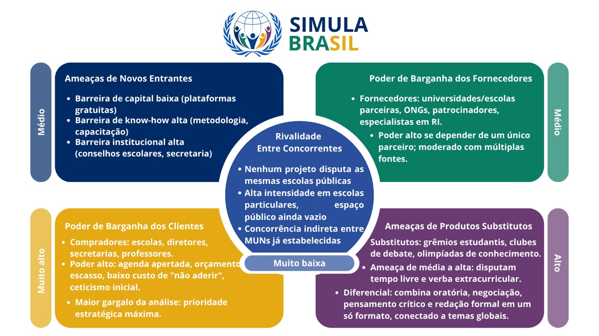
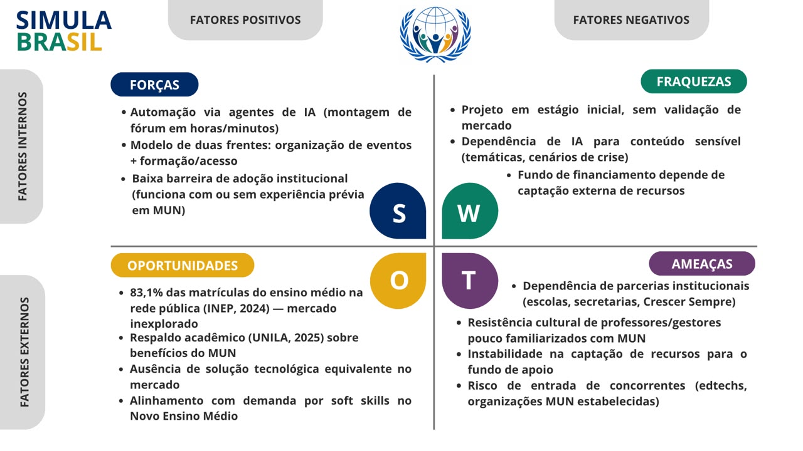
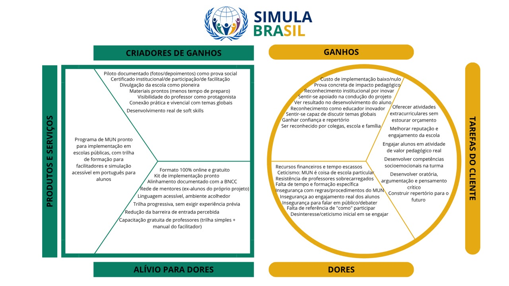
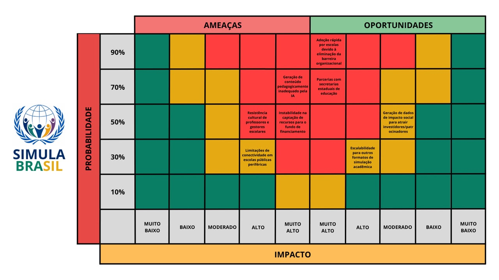
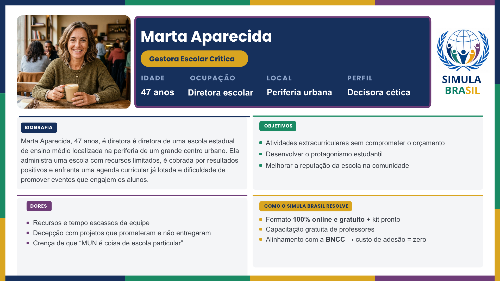
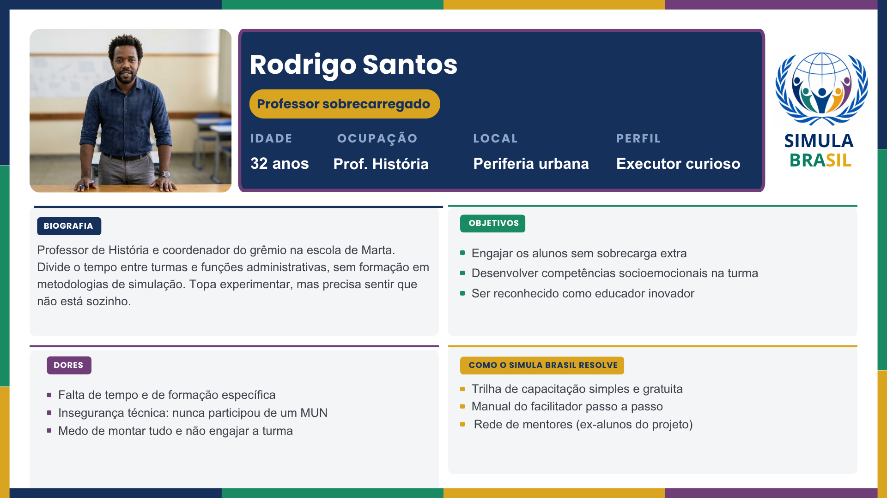
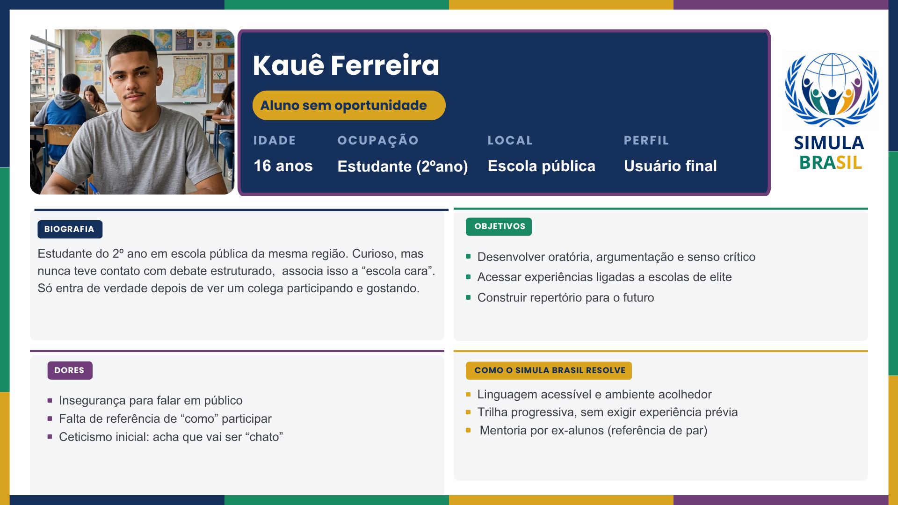
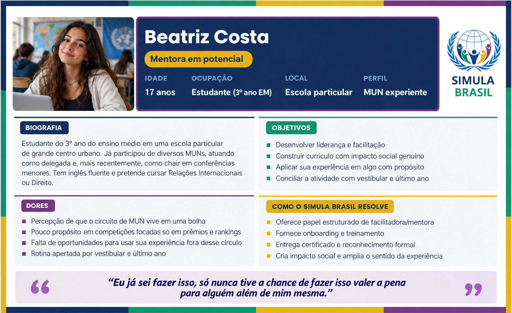
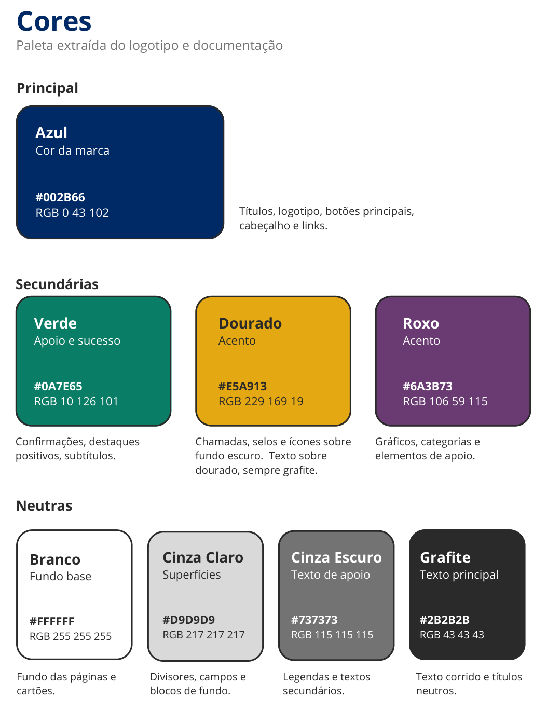
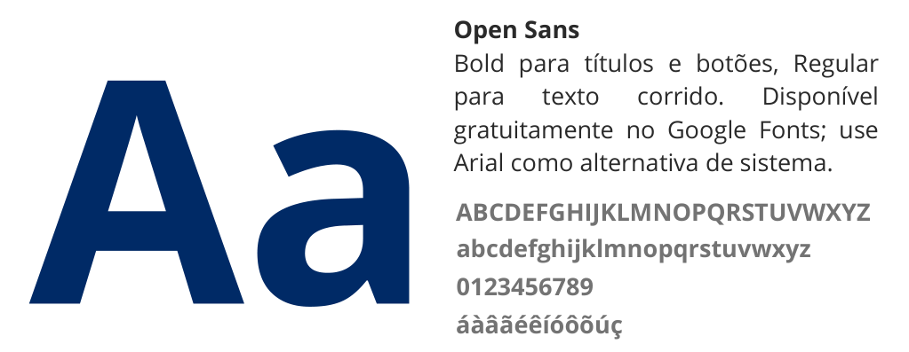

# WAD - Web Application Document

## Simula Brasil

#### Autores:

[Ademir Antônio dos Santos Júnior](https://www.linkedin.com/in/ademir-junior-9ba005357/)

[Igor da Silva Rodrigues](https://www.linkedin.com/in/igor-dasilva-rodrigues/)

[Júlia Amanda Gregate de Araujo](https://www.linkedin.com/in/julia-amanda-gregate-de-araujo/)

[Julia Jesus Bezerra](https://www.linkedin.com/in/julia-jesus-bezerra-a872b5321/)

## Sumário

[1. Introdução](#c1)

[2. Visão Geral da Aplicação Web](#c2)

[3. Projeto Técnico da Aplicação Web](#c3)

[4. Desenvolvimento da Aplicação Web](#c4)

[5. Testes da Aplicação Web](#c5)

[6. Estudo de Mercado e Plano de Marketing](#c6)

[7. Conclusões e trabalhos futuros](#c7)

[8. Referências](#c8)

<br>


# <a name="c1"></a>1. Introdução

&ensp; No Brasil, garantir que estudantes de escolas públicas desenvolvam soft skills e hard skills importantes, como trabalhar em grupo, pensar criticamente, falar em público e defender opiniões, ainda é um grande desafio. As simulações da ONU (MUN) estão entre as experiências mais eficazes para desenvolver essas competências, pesquisa da UNILA (2025) aponta que a participação em MUNs aprimora oratória, negociação e pensamento crítico, além de aprofundar a compreensão das relações internacionais.¹

&ensp; O problema é que esse tipo de oportunidade não chega à maior parte dos estudantes brasileiros. As simulações seguem concentradas em colégios particulares e faculdades, com inscrições que podem custar de R$100 a mais de R$1.000 por participante, o que inviabiliza a participação de alunos de baixa renda, muitos dos quais nem sabem que esse universo existe.² A barreira fica ainda mais evidente diante da escala da rede pública, segundo o Censo Escolar 2024 (INEP), 83,1% das matrículas do ensino médio estão na rede estadual pública.³ São justamente esses estudantes que as simulações hoje praticamente não alcançam. E, para quem organiza, há um segundo obstáculo: estruturar um fórum exige de semanas a meses de planejamento intensivo, inviabilizando o evento mesmo onde há vontade institucional.

&ensp; Nesse contexto, propomos o Simula Brasil, projeto que tem como objetivo fomentar o desenvolvimento de alunos periféricos por meio das simulações da ONU. A solução reúne diferentes sites e funcionalidades em torno de um mesmo propósito: democratizar o acesso ao universo MUN.

&ensp; A primeira frente é uma aplicação web que automatiza toda a estrutura organizacional de uma simulação, reduzindo um processo de semanas ou meses para poucas horas ou minutos com montagem automática do fórum, distribuição inteligente de países e comitês, geração de temáticas e cenários de crise por agentes de IA, formação de diretorias. O diferencial está no uso de agentes de inteligência artificial, que executam em minutos o que hoje demanda equipes inteiras.

&ensp; A segunda frente é uma plataforma voltada à formação e ao acesso de estudantes de baixa renda, reunindo conteúdo educacional, agenda de eventos, um fundo de financiamento para alunos em vulnerabilidade e a inscrição institucional em eventos parceiros.

&ensp; Além de reduzir drasticamente o tempo e o esforço de organização, a solução torna viável que qualquer escola, pública ou privada, com ou sem experiência prévia em MUN, realize seu próprio fórum, ao mesmo tempo em que oferece a estudantes de baixa renda o preparo e o acesso necessários para participar. Dessa forma, o Simula Brasil busca romper a barreira que hoje restringe as simulações da ONU à elite, ampliando o alcance de uma formação que desenvolve pensamento crítico, oratória e cidadania justamente entre os jovens que mais têm a ganhar com ela.

## <a name="c2"></a>2. Visão Geral da Aplicação Web

## 2.1. Escopo do Projeto

&ensp; O escopo do Simula Brasil é estruturado a partir de uma abordagem que integra a estratégia de negócios, o mapeamento de valor centrado nos usuários e a antecipação de riscos técnicos e institucionais. Como o projeto não atende a um cliente único, mas depende da adesão voluntária de escolas públicas, esta seção se desdobra em cinco análises interconectadas que sustentam a viabilidade da plataforma junto a gestores, professores e estudantes da rede pública.

&ensp; Inicialmente, o Modelo de 5 Forças de Porter contextualiza o espaço das simulações da ONU (Model United Nations, MUN) e evidencia que, embora a rivalidade direta seja baixa, o poder de barganha das escolas públicas é alto, já que para elas o custo de não aderir ao projeto é praticamente nulo. Na sequência, a Análise SWOT (Forças, Fraquezas, Oportunidades e Ameaças) confronta o principal diferencial do projeto, a automação da montagem de fóruns por agentes de inteligência artificial (IA), com suas fragilidades: a ausência de validação de mercado e a dependência de recursos externos para o fundo de financiamento estudantil. A mesma análise dimensiona a oportunidade a partir do Censo Escolar 2024, segundo o qual 83,1% das matrículas do ensino médio estão na rede estadual pública.<sup>[1](#ref1)</sup>

&ensp; Com base nesses diagnósticos, a seção de Solução detalha as duas frentes do projeto, a aplicação que gera automaticamente a estrutura do fórum e a plataforma de formação e acesso para estudantes de baixa renda, além da arquitetura adotada, com React, Node.js, PostgreSQL e agentes orquestrados em Python com LangGraph. O Value Proposition Canvas conecta essas funcionalidades às dores de três segmentos distintos (gestores escolares, professores e alunos) e mostra que o maior encaixe está nos estudantes, enquanto o maior risco de desencaixe está nos gestores, cujo ceticismo exige provas concretas de impacto. Por fim, a Matriz de Riscos antecipa ameaças como a geração de conteúdo pedagogicamente inadequado pela IA e a conectividade limitada em escolas periféricas, e estabelece planos de ação que orientam decisões de produto, como a curadoria humana do conteúdo gerado, o processamento assíncrono do fórum e a exportação do material para uso offline.

&ensp; Em conjunto, essas análises asseguram que o escopo delimitado não se restrinja a automatizar a organização de um evento, mas enfrente as duas barreiras que hoje restringem as simulações da ONU à elite educacional: a complexidade operacional para quem organiza e o custo de acesso para quem participa.

### 2.1.1. Modelo de 5 Forças de Porter

&ensp; O Modelo das 5 Forças de Porter é uma ferramenta de gestão criada por Michael Porter com o objetivo de analisar o ambiente competitivo de um mercado. O modelo se estrutura em cinco pilares que permitem identificar oportunidades e ameaças em um determinado setor: a rivalidade entre concorrentes diretos, a ameaça de novos entrantes, a ameaça de produtos ou serviços substitutos, o poder de barganha dos clientes e o poder de barganha dos fornecedores. Embora originalmente concebido para maximizar lucro em ambientes empresariais, o modelo se mostra igualmente útil como ferramenta de diagnóstico estratégico para projetos sociais e educacionais.

### Contexto da análise

&ensp; O projeto Simula Brasil atua no espaço das simulações de Modelo das Nações Unidas (MUN) como ferramenta de formação cidadã. Seu propósito central é levar esse formato, hoje concentrado quase exclusivamente em escolas particulares e universidades, para escolas públicas, de forma acessível e democrática.

<div align="center">
  <sub>Figura 1 — Modelo de 5 Forças de Porter</sub><br>
  <br>
  <sup>Fonte: Simula Brasil, 2026.</sup>
</div>

---

## 1. Análise da rivalidade entre concorrentes existentes

&ensp; No eixo estrito de mercado, a rivalidade é praticamente nula: atualmente não existem projetos disputando as mesmas escolas ou os mesmos alunos que o Simula Brasil busca atender. Ao se ampliar o olhar para além da disputa direta por clientela, no entanto, é possível identificar concorrentes indiretos: os circuitos de MUN já estabelecidos, como os organizados por universidades, escolas particulares e eventos pagos com taxas de inscrição elevadas.

&ensp; Essa rivalidade se manifesta com alta intensidade em grandes centros urbanos e entre escolas particulares, que frequentemente disputam prestígio por meio da participação em MUNs de renome. Entre as escolas públicas, porém, essa disputa é baixa ou praticamente inexistente, o que caracteriza o espaço em que o Simula Brasil pretende atuar como um território ainda vazio.

**Classificação:** Baixa

---

## 2. Poder de barganha dos fornecedores

&ensp; Os fornecedores do projeto são, principalmente, universidades e escolas parceiras — que cedem espaço físico e alunos com experiência na proposta, ONGs de educação, possíveis patrocinadores financeiros e especialistas em relações internacionais que contribuem com palestras e validação de conteúdo.

&ensp; O poder de negociação desses fornecedores é alto quando o projeto depende de um único parceiro, gerando vulnerabilidade em caso de retirada desse apoio. Esse poder se torna moderado quando existem múltiplas fontes alternativas de voluntários e recursos.

&ensp; Como implicação estratégica, recomenda-se a criação de um banco interno de facilitadores treinados, no qual ex-alunos do próprio Simula Brasil se formam e passam a atuar como mentores das edições seguintes — reduzindo, assim, a dependência de fornecedores externos ao longo do tempo.

**Classificação:** Moderada

---

## 3. Poder de barganha dos clientes

&ensp; Os compradores, neste contexto, são as escolas, diretores e coordenadores pedagógicos, secretarias de educação e professores que decidem abraçar o projeto.

&ensp; Esse poder é alto por diversos motivos: as escolas públicas possuem agenda curricular apertada e já disputam tempo com outros programas, como feiras de ciências; os recursos são escassos, e qualquer projeto que exija custo extra enfrenta resistência natural; o custo de "não aderir" é baixo, já que, se o projeto não convencer, a escola simplesmente o ignora e segue com suas atividades habituais; e há um ceticismo inicial por parte dos gestores, muitas vezes expresso em falas como "MUN é coisa de escola particular".

&ensp; Diante disso, a implicação estratégica é reduzir ao máximo o custo de adesão — por meio de formato 100% online e treinamento gratuito de professores, e conduzir um piloto bem documentado, com fotos e depoimentos de alunos que sirvam de prova social para convencer novas escolas.

**Classificação:** Alta

---

## 4. Ameaça de novos entrantes

&ensp; As barreiras de entrada nesse setor apresentam naturezas distintas. Em termos de capital financeiro, a barreira é baixa: não é necessário investimento robusto, já que plataformas gratuitas como Google Meet e Discord viabilizam a realização das simulações.

&ensp; Já em termos de know-how, a barreira é alta, pois a execução de um MUN de qualidade exige metodologia pedagógica consolidada, capacitação de professores e domínio das regras de procedimento das simulações.

&ensp; A barreira também é alta no aspecto institucional: para ingressar na rede de escolas públicas, é necessário passar pelo crivo de secretarias de educação, diretores e conselhos escolares, um processo burocrático que, na prática, funciona como proteção natural contra entrantes despreparados.

&ensp; Como implicação estratégica, recomenda-se documentar e padronizar a metodologia do projeto, de forma a criar uma marca de qualidade difícil de ser replicada rapidamente por terceiros. Também é estratégico buscar reconhecimento oficial junto a uma secretaria de educação e formar uma rede própria de facilitadores certificados, consolidando uma vantagem competitiva sustentável.

**Classificação:** Moderada

---

## 5. Ameaça de produtos substitutos

&ensp; Os principais substitutos identificados são os grêmios estudantis, os clubes de debate e oratória e as olimpíadas de conhecimento.

&ensp; A ameaça representada por esses substitutos é de média a alta intensidade, uma vez que todas essas atividades disputam o mesmo recurso escasso: o tempo livre e a atenção do aluno, além da verba e do espaço destinados a atividades extracurriculares na escola.

&ensp; O diferencial competitivo das simulações de MUN, no entanto, está em sua capacidade de combinar simultaneamente oratória, negociação diplomática, pensamento crítico sobre política internacional, redação formal e trabalho em equipe. Além disso, o formato conecta o aluno a temas globais de maneira prática e vivencial, algo que nenhum dos substitutos citados oferece de forma tão integrada.

**Classificação:** Média a Alta

---
## Conclusão

&ensp; A análise das cinco forças revela que o maior gargalo do projeto está no poder de negociação dos compradores — ou seja, das próprias escolas públicas —, cuja intensidade, neste contexto, é alta.

&ensp; Por essa razão, a prioridade de ação deve ser máxima nessa frente, concentrando esforços em reduzir o custo de adesão das escolas e em comprovar, de forma consistente e documentada, o impacto real do projeto Simula Brasil.

### 2.1.2. Análise SWOT

&ensp; A análise SWOT foi elaborada considerando o posicionamento do Simula Brasil no contexto da educação pública brasileira e do universo das simulações da ONU (MUN), um cenário marcado por forte desigualdade de acesso, baixa penetração de tecnologia na organização de eventos educacionais e crescente demanda por soft skills como pensamento crítico, oratória e negociação. A avaliação contempla fatores internos relativos à proposta de valor, à arquitetura tecnológica e à equipe do projeto, bem como fatores externos vinculados ao cenário educacional público, às barreiras financeiras dos estudantes e à ausência de concorrência direta no segmento. 

<div align="center">
  <sub>Figura 2 — Análise SWOT</sub><br>
  <br>
  <sup>Fonte: Autores, 2026.</sup>
</div>

**Forças (Ambiente interno)**

&ensp; O principal diferencial do Simula Brasil está no uso de agentes de inteligência artificial para automatizar a montagem de fóruns MUN, reduzindo um processo que hoje leva semanas ou meses de planejamento intensivo para poucas horas ou minutos, incluindo distribuição de países e comitês, geração de temáticas e cenários de crise, e formação de diretorias. Essa automação representa uma vantagem competitiva difícil de replicar manualmente. Outro ponto forte é o modelo de duas frentes complementares: a aplicação de organização de fóruns e a plataforma de formação e acesso para estudantes de baixa renda, o que amplia o impacto do projeto para além da simples tecnologia, atacando também o problema de letramento sobre o universo MUN. A proposta ainda conta com baixa barreira de adoção institucional, pois permite que qualquer escola, com ou sem experiência prévia em simulações, organize seu próprio evento.

**Fraquezas (Ambiente interno)**

&ensp; Como projeto em estágio inicial, o Simula Brasil enfrenta a ausência de histórico e validação de mercado, o que pode gerar resistência de escolas e instituições parceiras na adoção de uma ferramenta ainda não testada em larga escala. A dependência de agentes de IA para geração de conteúdo sensível (temáticas, cenários de crise, distribuição de comitês) exige validação pedagógica cuidadosa, já que erros de geração podem comprometer a credibilidade do produto perante educadores. Além disso, a proposta inclui um fundo de financiamento para alunos em vulnerabilidade, o que introduz uma dependência de captação de recursos externos (parcerias, patrocínios ou doações) que foge do controle direto do produto tecnológico e pode limitar a escalabilidade dessa frente caso o financiamento não seja sustentável.

**Oportunidades (Ambiente externo)**

&ensp; O contexto atual é altamente favorável: segundo o Censo Escolar 2024 (INEP), 83,1% das matrículas do ensino médio estão na rede estadual pública.<sup>[1](#ref1)</sup> , evidenciando um mercado praticamente inexplorado para simulações da ONU, hoje concentradas em colégios particulares e faculdades. A pesquisa da UNILA (2025) reforça a legitimidade pedagógica da proposta, ao demonstrar que a participação em MUNs aprimora oratória, negociação e pensamento crítico <sup>[2](#ref2)</sup> , o que facilita o discurso institucional junto a secretarias de educação e escolas públicas. Some-se a isso a crescente pressão por desenvolvimento de competências socioemocionais (soft skills) na educação básica brasileira, alinhada a políticas públicas e ao próprio Novo Ensino Médio. A ausência de uma solução tecnológica equivalente no mercado brasileiro representa uma janela de pioneirismo para o Simula Brasil se consolidar como referência antes que outros players entrem no espaço.

**Ameaças (Ambiente externo)**

&ensp; A principal ameaça externa é a dependência de parcerias institucionais (escolas, secretarias de educação, organizações como a Associação Crescer Sempre) para viabilizar o piloto e a escala do projeto, o que expõe o Simula Brasil a riscos de descontinuidade caso essas parcerias não se sustentem. Também há o risco de resistência cultural de professores e gestores escolares pouco familiarizados com o universo MUN, o que pode desacelerar a adoção mesmo diante da automação oferecida. Do ponto de vista financeiro, a captação de recursos para o fundo de apoio a estudantes vulneráveis depende de fatores macroeconômicos e de doação/patrocínio, sujeitos a instabilidades. Por fim, à medida que o projeto ganha tração, existe a possibilidade de entrada de concorrentes, sejam startups edtech ou iniciativas de grandes organizações MUN já estabelecidas, que podem tentar replicar o modelo de automação por IA.

---

&ensp; A análise evidencia que o Simula Brasil possui uma proposta de valor inovadora e tecnicamente diferenciada, sustentada por um problema social relevante e por uma janela de oportunidade praticamente sem concorrência direta. O principal desafio está em validar a solução junto a escolas públicas e garantir a sustentabilidade do fundo de financiamento, sendo essas as frentes que determinarão a capacidade do projeto de romper, de fato, a barreira que hoje restringe as simulações da ONU à elite educacional brasileira.

### 2.1.3. Solução

**1 - Problema a ser resolvido:**

&ensp; As simulações da ONU (MUN) são reconhecidas como uma das metodologias mais eficazes para o desenvolvimento de competências socioemocionais e técnicas em estudantes, mas permanecem estruturalmente restritas a instituições privadas e universidades. Essa restrição decorre de dois fatores combinados: o alto custo de participação, que exclui estudantes de baixa renda, e a elevada complexidade operacional de organizar um fórum, que demanda de semanas a meses de trabalho e equipes numerosas. O resultado é a exclusão da rede pública, responsável pela maior parte das matrículas do ensino médio no país, de uma formação com comprovado impacto no desenvolvimento de pensamento crítico, oratória e cidadania.

**2 - Dados disponíveis:**

&ensp; O projeto não dispõe de uma base de dados primária estruturada. A fundamentação apoia-se em: dados educacionais oficiais do Censo Escolar 2024 (INEP), que dimensionam a rede pública e evidenciam o público potencial da solução; artigos científicos já publicados sobre o impacto pedagógico das simulações da ONU e sua relevância no mercado educacional; e um artigo científico próprio, em desenvolvimento, voltado a consolidar evidências sobre a importância e o potencial de escala das simulações no contexto brasileiro.

**3 - Solução proposta:**

&ensp; A solução consiste em uma aplicação web que automatiza a estrutura organizacional de uma simulação da ONU e a integra a uma plataforma de formação e acesso para estudantes de baixa renda. A aplicação será desenvolvida com React no front-end, Node.js no back-end e PostgreSQL como banco de dados relacional, garantindo escalabilidade e integridade das informações; a camada de inteligência artificial será construída em Python com o framework LangGraph, responsável por orquestrar os múltiplos agentes do sistema. O sistema conta com: geração automática da estrutura do fórum a partir dos dados de inscrição; distribuição inteligente de países e comitês; agentes de inteligência artificial responsáveis por gerar temáticas e cenários de crise; formação automatizada das diretorias; e uma plataforma complementar de formação, com conteúdo educacional, agenda de eventos, fundo de financiamento e inscrição institucional em eventos parceiros.

**4 - Forma de utilização da solução:**

&ensp; O organizador, escola, coletivo ou instituição, acessa a aplicação e informa os dados básicos do evento (número de participantes, escolas envolvidas e nível de experiência dos delegados). A partir dessas informações, os agentes de IA geram automaticamente a estrutura completa do fórum, cabendo ao organizador revisar e ajustar o resultado antes da realização. Paralelamente, os estudantes utilizam a plataforma de formação para se preparar, acompanhar a agenda de eventos e, quando elegíveis, acessar o fundo de financiamento e a inscrição institucional.

**5 - Benefícios esperados:**

&ensp; Espera-se reduzir drasticamente o tempo e o esforço necessários para organizar uma simulação, tornando viável a realização de fóruns em escolas sem estrutura ou experiência prévia em MUN. Do lado dos estudantes, espera-se ampliar o acesso da rede pública a uma formação de alto impacto, contribuindo para o desenvolvimento de competências valorizadas acadêmica e profissionalmente e para a redução da desigualdade de oportunidades nesse campo.

**6 - Critério de sucesso e como será avaliado:**

&ensp; O sucesso será medido pela implementação real da solução em pelo menos uma escola pública, viabilizando um fórum que antes seria inviável. Os critérios incluem: geração completa e automatizada da estrutura de um fórum, sem intervenção manual na etapa de montagem; realização de ao menos uma simulação com alunos da rede pública utilizando a plataforma; e, como indicador de impacto de médio prazo, a premiação de pelo menos um aluno participante em uma simulação externa reconhecida, como o FAAP MUN ou o SPMUN. A avaliação ocorrerá de forma contínua, por meio de testes das funcionalidades a cada sprint e do acompanhamento dos alunos nos eventos externos.

### 2.1.4. Value Proposition Canvas

&ensp; O Canvas de Proposta de Valor é a ferramenta que explica por que o cliente escolheria uma organização em vez de outra alternativa disponível. Ele deve responder a perguntas centrais como: qual problema estamos resolvendo? Qual necessidade estamos satisfazendo? Que pacote de produtos ou serviços estamos oferecendo a cada segmento de cliente? O objetivo é garantir que aquilo que a proposta oferece esteja de fato alinhado com o que o cliente precisa, deseja e sofre no seu dia a dia. A ferramenta se estrutura em três elementos: as tarefas do cliente (o que ele está tentando fazer, resolver ou alcançar), as dores (obstáculos, riscos e frustrações enfrentados antes, durante ou depois de tentar realizar essas tarefas) e os ganhos (benefícios e resultados que ele deseja obter).


<div align="center">
  <sub>Figura 3 — Value Proposition Canvas</sub><br>
  <br>
  <sup>Fonte: Simula Brasil, 2026.</sup>
</div>
 

---

#### Segmento 1 — Escolas e gestores (decisores da adesão)

#### A. Perfil do Cliente

&ensp; **Público-alvo principal:** Escolas públicas, diretores, coordenadores pedagógicos e secretarias de educação.

&ensp; **Público secundário:** Professores envolvidos na implementação do projeto.

#### a) Tarefas do cliente

&ensp; As tarefas desse segmento envolvem oferecer atividades extracurriculares sem comprometer o orçamento, melhorar a reputação e o engajamento da escola perante a comunidade, e cumprir exigências da BNCC, como o desenvolvimento do protagonismo estudantil.

#### b) Dores

&ensp; As principais dores identificadas são os recursos financeiros limitados, o tempo escasso da equipe gestora, o receio de investir em uma iniciativa que a comunidade escolar não se interesse, o ceticismo em relação à ideia de que "MUN é coisa de escola particular" e a resistência natural de professores já sobrecarregados diante da possibilidade de assumir mais uma atividade.

#### c) Ganhos

&ensp; Os ganhos desejados por esse público são a prova concreta de impacto pedagógico, um custo de implementação baixo ou próximo de zero, e o reconhecimento institucional por adotar uma postura inovadora perante a comunidade.

#### B. Mapa de Valor

#### a) Produtos e Serviços

&ensp; Como resposta a essas dores, o Simula Brasil oferece um formato 100% online e gratuito, capacitação gratuita de professores, um kit de implementação pronto e alinhamento explícito com a BNCC.

#### b) Aliviadores de Dores

&ensp; O formato 100% online e gratuito reduz a barreira financeira, a capacitação gratuita prepara os professores para conduzir a atividade e o kit de implementação diminui o esforço necessário para colocar o projeto em prática.

#### c) Criadores de Ganho

&ensp; Como criadores de ganho, o projeto disponibiliza fotos e depoimentos que funcionam como prova social, certificado institucional de participação e a possibilidade de divulgação da escola como pioneira na iniciativa.

---

#### Segmento 2 — Professores e coordenadores (quem executa)

#### A. Perfil do Cliente

&ensp; **Público-alvo principal:** Professores e coordenadores pedagógicos.

&ensp;**Público secundário:** Facilitadores e mentores do projeto.

#### a) Tarefas do cliente

&ensp; Esse segmento busca engajar os alunos em atividades de valor pedagógico real, sem sobrecarga extra de trabalho, além de desenvolver competências interpessoais e socioemocionais na turma.

#### b) Dores

&ensp; As dores enfrentadas incluem a falta de tempo e de formação específica para conduzir uma simulação, a insegurança quanto às regras e procedimentos do MUN, e a insegurança em relação ao engajamento real dos alunos — o receio de montar toda a estrutura da atividade e, mesmo assim, não conseguir despertar interesse genuíno na turma.

#### c) Ganhos

&ensp; Os ganhos desejados são sentir-se apoiado na condução do projeto, ver resultado concreto no desenvolvimento dos alunos e ser reconhecido como um educador inovador.

#### B. Mapa de Valor

#### a) Produtos e Serviços

&ensp; Para aliviar essas dores, o Simula Brasil oferece uma trilha de capacitação simples e gratuita, além de uma rede de mentores formada, entre outros, por ex-alunos do próprio projeto.

#### b) Aliviadores de Dores

&ensp; A trilha de capacitação reduz a insegurança dos professores, enquanto a rede de mentores oferece suporte durante a implementação e execução das simulações.

### c) Criadores de Ganho

&ensp; Como criadores de ganho, o projeto disponibiliza certificados de facilitação, materiais prontos que reduzem o tempo de preparo, e visibilidade do professor como protagonista da iniciativa dentro da escola.

---

# Segmento 3 — Alunos de escola pública (usuário final)

#### A. Perfil do Cliente

&ensp; **Público-alvo principal:** Alunos da rede pública de ensino.

&ensp; **Público secundário:** Estudantes interessados em desenvolver competências acadêmicas e socioemocionais.

### a) Tarefas do cliente

&ensp; As tarefas desse segmento envolvem desenvolver soft skills como oratória, argumentação e pensamento crítico, acessar experiências de aprendizado hoje associadas a escolas de elite, e construir repertório para o futuro acadêmico e profissional.

### b) Dores

&ensp; As dores identificadas são a insegurança para falar em público ou debater temas complexos, a falta de referência de "como" participar — por nunca terem tido acesso antes a esse tipo de formato —, e o desinteresse do próprio aluno em se engajar com a proposta.

### c) Ganhos

&ensp; Os ganhos desejados incluem sentir-se capaz de discutir temas globais com propriedade, ganhar confiança e repertório para o futuro, e ser reconhecido por colegas, escola e família por essa conquista.

#### B. Mapa de Valor

#### a) Produtos e Serviços

&ensp; Como aliviadores de dor, o Simula Brasil oferece linguagem acessível em português, um ambiente acolhedor, uma trilha progressiva que não exige experiência prévia e uma metodologia desenvolvida para facilitar a participação dos estudantes.

#### b) Aliviadores de Dores

&ensp; O projeto reduz deliberadamente a barreira de entrada percebida pelo aluno, oferecendo suporte durante toda a experiência e um ambiente que favorece a participação mesmo de quem nunca teve contato com um MUN.

#### c) Criadores de Ganho

&ensp; Como criadores de ganho, o projeto entrega certificado de participação, desenvolvimento real de soft skills e conexão prática e vivencial com temas globais.

---

#### Encaixe (Fit) e ponto de atenção

&ensp; O maior encaixe do projeto está no segmento de alunos: a dor de exclusão é real e concreta, e a entrega do Simula Brasil resolve isso de forma direta.

&ensp; Já o maior risco de desencaixe está no segmento de gestores escolares, cujas dores — tempo, custo e ceticismo — exigem que os aliviadores de dor sejam extremamente concretos e visíveis. Caso contrário, a proposta de valor não se converte em adesão real, mesmo sendo bem construída no papel.

## Conclusão

&ensp; A aplicação do Canvas de Proposta de Valor evidencia que o Simula Brasil atende diferentes segmentos de clientes, cada um com necessidades, desafios e expectativas específicas. Enquanto gestores escolares buscam soluções de baixo custo e impacto comprovado, professores necessitam de apoio metodológico e materiais que reduzam sua carga de trabalho, e os estudantes procuram oportunidades de desenvolvimento pessoal e acadêmico que normalmente não estão disponíveis em seu contexto.

&ensp; A análise demonstra que a proposta de valor do projeto está alinhada às principais dores desses públicos, oferecendo soluções concretas para reduzir barreiras de acesso e ampliar o engajamento. Ainda assim, o sucesso da iniciativa depende especialmente da capacidade de convencer gestores escolares sobre sua viabilidade e impacto, tornando essencial a produção de evidências, a realização de projetos-piloto e o fortalecimento de parcerias institucionais. Dessa forma, o Canvas de Proposta de Valor reforça que o diferencial do Simula Brasil não está apenas na realização de simulações de MUN, mas na democratização desse tipo de experiência educacional para estudantes da rede pública de ensino.

### 2.1.5. Matriz de Riscos do Projeto

&ensp; A Matriz de Riscos é uma ferramenta visual utilizada para priorizar os riscos de um projeto com base em duas dimensões: probabilidade, que mede a chance de um risco ocorrer, e impacto, que representa suas consequências caso se concretize (PROJECT MANAGEMENT INSTITUTE, 2017). A combinação dessas dimensões gera uma classificação geral — alta, média ou baixa — representada por cores, facilitando o foco nos riscos mais críticos e orientando a construção de planos de ação preventivos.

<div align="center">
  <sub>Figura 4 — Matriz de Riscos</sub><br>
  <br>
  <sup>Fonte: Autores, 2026.</sup>
</div>

**AM01**

**Risco:** Geração de conteúdo pedagogicamente inadequado pela IA
**Probabilidade:** 70% (Alta)
**Impacto:** Muito Alto
&ensp;**Descrição:** O núcleo da solução depende de agentes de IA para gerar temáticas, cenários de crise e distribuição de países/comitês. Se a IA produzir conteúdo impreciso, tendencioso ou pedagogicamente inadequado (por exemplo, um cenário de crise mal contextualizado historicamente), a credibilidade do produto perante professores e escolas públicas pode ser comprometida logo no primeiro uso.
&ensp;**Plano de Ação:** Implementar uma camada de revisão humana (curadoria pedagógica) antes da publicação de qualquer conteúdo gerado por IA, além de prompts estruturados com validação por especialistas da educação.

**AM02**

**Risco:** Instabilidade na captação de recursos para o fundo de financiamento
**Probabilidade:** 50% (Moderada)
**Impacto:** Muito Alto
&ensp;**Descrição:** A frente de formação e acesso depende de um fundo de financiamento para estudantes em vulnerabilidade, sustentado por parcerias, patrocínios ou doações externas. Uma eventual descontinuidade de aportes compromete diretamente a promessa central de democratização de acesso do projeto.
&ensp;**Plano de Ação:** Diversificar as fontes de captação (editais públicos, patrocínio corporativo via leis de incentivo, parcerias com ONGs) e estabelecer um fundo de reserva mínimo antes de comprometer vagas financiadas.

**AM03**

**Risco:** Resistência cultural de professores e gestores escolares
**Probabilidade:** 50% (Moderada)
**Impacto:** Alto
&ensp;**Descrição:** Grande parte dos professores e gestores da rede pública não possui familiaridade com o universo MUN nem com ferramentas de automação por IA. Isso pode gerar desconfiança quanto à legitimidade do processo automatizado, atrasando a adoção institucional mesmo diante da economia de tempo oferecida.
&ensp;**Plano de Ação:** Desenvolver materiais de onboarding simplificados e um piloto guiado (com apoio direto da equipe) nas primeiras escolas parceiras para gerar cases de sucesso replicáveis.

**AM04**

**Risco:** Limitações de conectividade em escolas públicas periféricas
**Probabilidade:** 30% (Baixa)
**Impacto:** Alto
&ensp;**Descrição:** As escolas públicas, especialmente em regiões periféricas, podem enfrentar internet instável ou inexistente, dificultando o uso de uma plataforma que depende de processamento de IA em tempo real para montar o fórum.
&ensp;**Plano de Ação:** Estruturar fluxos assíncronos (ex: geração do fórum pode ser solicitada e processada em background, com notificação quando pronta) e permitir exportação offline do material gerado (PDF/CSV) para uso posterior sem necessidade de conexão contínua.

### 2.1.5.2. Oportunidades

**OP01**

**Risco:** Adoção rápida por escolas devido à eliminação da barreira organizacional
**Probabilidade:** 90% (Muito Alta)
**Impacto:** Muito Alto
&ensp;**Descrição:** Hoje, organizar um fórum MUN exige semanas ou meses de planejamento manual. Se a automação por IA reduzir esse processo para horas, escolas com pouco ou nenhum histórico em simulações passam a enxergar a organização de um evento próprio como algo viável, o que pode gerar adoção orgânica acelerada.
&ensp;**Plano de Ação:** Garantir que o fluxo de criação do fórum tenha uma experiência "à prova de erros" (onboarding simples, poucos cliques), já que esse será o principal gatilho de conversão de novas escolas.

**OP02**

**Risco:** Parcerias com secretarias estaduais de educação
**Probabilidade:** 70% (Alta)
**Impacto:** Muito Alto
&ensp;**Descrição:** Como 83,1% das matrículas do ensino médio estão na rede estadual, uma parceria institucional com secretarias de educação pode viabilizar a adoção em escala (centenas de escolas de uma vez), em vez de depender de adesão escola por escola.
&ensp;**Plano de Ação:** Preparar um material institucional específico para secretarias, com foco em impacto social mensurável e alinhamento com o Novo Ensino Médio, para viabilizar reuniões e projetos-piloto regionais.

**OP03**

**Risco:** Geração de dados de impacto social para atrair investidores e patrocinadores
**Probabilidade:** 50% (Moderada)
**Impacto:** Moderado
&ensp;**Descrição:** Ao centralizar a organização de fóruns e o acesso de estudantes de baixa renda em uma única plataforma, o Simula Brasil passa a gerar dados estruturados de impacto (nº de estudantes atendidos, escolas participantes, evolução de habilidades). Esses dados podem ser usados como ativo estratégico para atrair patrocinadores de impacto social e editais de fomento.
&ensp;**Plano de Ação:** Estruturar desde o início um painel simples de métricas de impacto (dashboard), pensado tanto para uso interno quanto para apresentações a potenciais parceiros e financiadores.

**OP04**

**Risco:** Escalabilidade para outros formatos de simulação acadêmica
**Probabilidade:** 30% (Baixa)
**Impacto:** Alto
&ensp;**Descrição:** Embora o escopo inicial seja o MUN, a arquitetura de automação por IA (distribuição de papéis, geração de cenários, formação de diretorias) pode ser generalizada para outros tipos de simulação educacional (ex: simulações legislativas, tribunais simulados, feiras de ciências), ampliando o mercado endereçável do produto.
&ensp;**Plano de Ação:** Desenvolver os módulos de geração de conteúdo (temáticas, papéis, cenários) de forma flexível e adaptável, para que não fiquem limitados exclusivamente ao formato ONU.

## 2.2. Personas

&ensp; Durante essa seção, nossa equipe utilizou o conceito de proto-personas para identificar os perfis de usuários que a plataforma irá atender. Proto-personas são representações hipotéticas construídas com base no conhecimento prévio da equipe e nos dados disponíveis sobre o contexto do projeto, sem necessariamente passar por pesquisas formais com usuários reais (GOTHELF; SEIDEN, 2013).

### 2.2.1 Persona - Marta - Gestora Escolar Crítica 

<div align="center">
  <sub>Figura 5 — Persona Gestora Escolar Crítica (decisora)</sub><br>
  <br>
  <sup>Fonte: Simula Brasil, 2026.</sup>
</div>

&ensp; Marta Aparecida, 47 anos, é diretora de uma escola estadual de ensino médio localizada na periferia de um grande centro urbano. Ela administra uma escola com recursos limitados, é cobrada por resultados positivos e enfrenta uma agenda curricular já lotada.

&ensp; Seus principais objetivos são oferecer atividades extracurriculares sem comprometer o orçamento, desenvolver o protagonismo estudantil e melhorar a reputação da escola perante a comunidade. Entre suas dores estão os recursos financeiros e o tempo escasso da equipe, a decepção com projetos externos anteriores que prometeram e não entregaram, a crença de que "MUN é coisa de escola particular" e distante da realidade da sua escola, além da resistência de professores já sobrecarregados diante da possibilidade de assumir mais uma atividade.

&ensp; Diante do Simula Brasil, Marta não vai atrás do projeto, é o projeto que precisa convencê-la, com pouco esforço e risco praticamente nulo da parte dela. Ela responde melhor a provas concretas do que a promessas, o que resume sua postura na frase: "Eu não tenho tempo nem verba para apostar em algo que pode não dar em nada." O Simula Brasil resolve isso oferecendo formato 100% online e gratuito, kit de implementação pronto, capacitação gratuita de professores e alinhamento documentado com a BNCC, reduzindo o custo de adesão a praticamente zero.

### 2.2.2 Persona - Rodrigo Santos - O Professor Sobrecarregado, mas Curioso 

<div align="center">
  <sub>Figura 6 — Professor Sobrecarregado, mas Curioso (quem executa)</sub><br>
  <br>
  <sup>Fonte: Simula Brasil, 2026.</sup>
</div>

&ensp; Rodrigo Santos, 34 anos, é professor de História e coordenador do grêmio estudantil na mesma escola de Marta. Ele tenta trazer atividades diferentes para os alunos, mas divide seu tempo entre várias turmas e funções administrativas, sem formação específica em metodologias de simulação.

&ensp; Seus objetivos são engajar os alunos em atividades de valor sem sobrecarga extra, desenvolver competências interpessoais e socioemocionais na turma e ser reconhecido como um educador que trouxe inovação para a escola. Suas dores incluem a falta de tempo e formação específica para realizar simulações, a insegurança técnica por nunca ter participado de um MUN e não dominar as regras, e o medo de montar toda a estrutura da atividade e, mesmo assim, não conseguir despertar o interesse da turma.

&ensp; Rodrigo aceita experimentar o Simula Brasil, mas precisa sentir que não está sozinho. Ele busca suporte, não apenas material teórico, e reage bem a exemplos práticos e ao contato com quem já viveu a experiência. Isso se resume na frase: "Eu quero fazer diferente, mas não posso correr o risco de bancar isso sozinho e ver os alunos perderem o interesse na segunda aula." O projeto resolve essas dores por meio de uma trilha de capacitação simples e gratuita, um manual do facilitador e uma rede de mentores formada por ex-alunos do próprio projeto, reduzindo tanto a insegurança técnica quanto o medo do desengajamento da turma.

### 2.2.3 Persona - Kauê Ferreira - O Aluno que Nunca Teve a Chance 

<div align="center">
  <sub>Figura 7 — Kauê Ferreira - O Aluno que Nunca Teve a Chance (usuário final)</sub><br>
  <br>
  <sup>Fonte: Simula Brasil, 2026.</sup>
</div>

&ensp; Kauê Ferreira, 16 anos, é estudante do 2º ano do ensino médio em uma escola pública da mesma região. Ele é curioso e tem opinião sobre assuntos atuais, mas nunca teve contato com atividades como debate estruturado ou simulações. Ele associa esse tipo de coisa a "escola cara", algo que não é para alguém como ele.

&ensp; Seus objetivos são desenvolver oratória, argumentação e pensamento crítico, acessar experiências de aprendizado hoje associadas a escolas de elite e construir repertório para o futuro acadêmico e profissional. Entre suas dores estão a insegurança para falar em público ou debater temas complexos, a falta de referência de "como" participar, por nunca ter tido acesso a esse formato antes, e um certo ceticismo inicial misturado com preguiça de se engajar, por achar que vai ser "chato" ou "difícil demais".

&ensp; Kauê só se engaja de verdade depois de ver alguém parecido com ele participando e gostando; um colega, não um adulto ou uma autoridade dizendo que "é importante", e precisa de uma primeira experiência de baixo esforço para não desistir antes de começar. Isso se resume na frase: "Isso parece coisa que não é pra mim, só vou levar a sério se eu ver alguém como eu fazendo e curtindo." O Simula Brasil resolve essa barreira com linguagem acessível em português, ambiente acolhedor, trilha progressiva sem exigir experiência prévia e mentoria por ex-alunos do próprio projeto, reduzindo a barreira de entrada percebida.

### 2.2.4 Persona - Beatriz Costa - A Aluna que Teve Chances 

<div align="center">
  <sub>Figura 8 — Beatriz Costa - A aluna que teve chances (usuário final)</sub><br>
  <br>
  <sup>Fonte: Simula Brasil, 2026.</sup>
</div>

&ensp; Beatriz Costa, 17 anos, é estudante do 3º ano do ensino médio em uma escola particular de grande centro urbano. Já participou de diversos MUNs, atuando como delegada e, mais recentemente, como chair em conferências menores. Tem inglês fluente e pretende cursar Relações Internacionais ou Direito.

&ensp; Ela busca desenvolver habilidades de liderança e facilitação e construir um currículo com experiências de impacto social genuíno. Apesar disso, sente que o circuito de MUN está preso a uma “bolha”, com os mesmos perfis de alunos e escolas, além de perceber pouco propósito em competições focadas apenas em prêmios e rankings. Também tem dificuldade em encontrar oportunidades para usar sua experiência fora desse círculo e precisa conciliar qualquer atividade com o último ano do ensino médio e o vestibular.

&ensp; Beatriz geralmente conheceria o Simula Brasil por meio de sua escola, MUNs ou professores. Ao descobrir o projeto, tende a se engajar rapidamente, principalmente pelo propósito social. Ela valoriza funções estruturadas, onboarding, certificado e possibilidade de recomendação.

&ensp; “Eu já sei fazer isso, só nunca tive a chance de fazer isso valer a pena para alguém além de mim mesma.”

&ensp; O Simula Brasil aproveita sua experiência oferecendo um papel de facilitadora/mentora com treinamento e reconhecimento formal. Dessa forma, além de dar um novo sentido à experiência de Beatriz, o projeto cria uma rede própria de voluntários e reduz sua dependência de universidades e ONGs externas.


## 2.3. User Stories

&ensp; Esta seção apresenta as User Stories do Simula Brasil, que traduzem as dores e os objetivos das personas da seção 2.2 em funcionalidades da plataforma. São doze histórias, três para cada persona: Marta Aparecida, a gestora que decide se a escola adere ao projeto; Rodrigo Santos, o professor que organiza o fórum; Kauê Ferreira, o aluno da rede pública que participa de uma simulação pela primeira vez; e Beatriz Costa, a aluna com experiência em MUN que atua como mentora voluntária.

&ensp; Cada história é escrita do ponto de vista da persona e vem acompanhada de critérios de aceite no formato Dado/Quando/Então, que descrevem o comportamento esperado do sistema e orientam a validação da funcionalidade. Ao final de cada quadro, a análise INVEST (Independente, Negociável, Valiosa, Estimável, Small/Pequena e Testável) verifica se a história está bem definida para ser desenvolvida.

&ensp; As histórias foram classificadas em dois níveis de prioridade. São de alta prioridade as que compõem o fluxo essencial de cada persona: aderir ao projeto, organizar o fórum, preparar-se e ter acesso aos eventos, e mentorar. São de média prioridade as que complementam esse fluxo com comprovação de impacto, inscrição em eventos parceiros e reconhecimento formal do voluntariado.

### 2.3.1. Marta Aparecida — gestora escolar 
 
<div align="center">
  <sub>Quadro 1 — Primeira User Story</sub>
</div>

Identificação | US01 – Solicitar piloto documentado (Alta prioridade)
--- | ---
Persona | Marta Aparecida
User Story | Como gestora escolar responsável pela decisão de adesão, quero solicitar a implementação de um piloto documentado do Simula Brasil na minha escola e acompanhar seus resultados para decidir, com risco e custo praticamente nulos, se aprovo a expansão do projeto.
Critério de aceite 1 | CR1: Dado que a gestora acessa a opção "Solicitar piloto", quando a tela for carregada então o sistema deve exibir o formulário de solicitação com os campos obrigatórios: nome da escola, rede de ensino, município, número estimado de alunos participantes e professor responsável.
Critério de aceite 2 | CR2: Dado que a gestora está no formulário, quando informar o número estimado de alunos participantes então o sistema deve exigir um valor numérico inteiro maior que zero.
Critério de aceite 3 | CR3: Dado que a gestora está no formulário, quando tentar enviar sem preencher os campos obrigatórios então o sistema deve exibir mensagens de validação indicando os campos pendentes.
Critério de aceite 4 | CR4: Dado que a gestora preencheu corretamente todos os campos obrigatórios, quando confirmar a solicitação então o sistema deve registrar o piloto com status "Solicitado" e exibir uma mensagem de confirmação informando que a adesão não tem custo para a escola.
Critério de aceite 5 | CR5: Dado que a escola já possui um piloto solicitado ou em andamento, quando a gestora tentar abrir uma nova solicitação então o sistema deve impedir a duplicidade e direcioná-la para o acompanhamento do piloto existente.
Critério de aceite 6 | CR6: Dado que existe um piloto registrado para a escola, quando a gestora acessar "Acompanhar piloto" então o sistema deve exibir o status atual (Solicitado, Em preparação, Em execução ou Concluído) e as etapas já cumpridas.
Critério de aceite 7 | CR7: Dado que o piloto está em execução ou concluído, quando a gestora acessar o acompanhamento então o sistema deve exibir os resultados registrados: alunos participantes, professores capacitados e simulações realizadas.
Critério de aceite 8 | CR8: Dado que o piloto foi concluído, quando a gestora selecionar "Aprovar expansão" ou "Encerrar participação" então o sistema deve registrar a decisão e exibir uma mensagem de confirmação.
Critério de aceite 9 | CR9: Dado que o piloto ainda não foi concluído, quando a gestora tentar registrar a decisão de expansão então o sistema deve impedir a ação e informar a etapa pendente.
Critério de aceite 10 | CR10: Dado que ocorre uma falha ao registrar a solicitação, quando a gestora confirmar o envio então o sistema deve exibir uma mensagem de erro clara e manter os dados já preenchidos no formulário.
Critérios INVEST | <ul><li>I (Independente): depende apenas do cadastro da escola e da gestora; não exige que a geração do fórum (US04) esteja pronta para ser solicitada.</li><li>N (Negociável): os campos do formulário e os nomes dos status do piloto podem ser ajustados sem alterar o objetivo de reduzir o risco percebido pela gestora.</li><li>V (Valiosa): ataca a força mais intensa das 5 Forças de Porter (poder de barganha das escolas) e executa o piloto guiado previsto no plano de ação do risco AM03, ao permitir que a gestora teste o projeto antes de se comprometer.</li><li>E (Estimável): escopo fechado em um formulário, uma tela de acompanhamento e um registro de decisão.</li><li>S (Small/Pequena): cabe em uma sprint, dividida em solicitação, acompanhamento e decisão.</li><li>T (Testável): os critérios cobrem validação de campos, duplicidade, exibição de status, decisão dentro e fora do prazo e tratamento de erro.</li></ul>
 
<div align="center">
  <sup>Fonte: Autores, 2026.</sup>
</div>
<br>
<div align="center">
  <sub>Quadro 2 — Segunda User Story</sub>
</div>

Identificação | US02 – Acessar kit de implementação e capacitação gratuita (Alta prioridade)
--- | ---
Persona | Marta Aparecida
User Story | Como gestora escolar, quero acessar o kit de implementação pronto e o cronograma de capacitação gratuita de professores para viabilizar a adoção do projeto sem custo extra e sem sobrecarregar minha equipe.
Critério de aceite 1 | CR1: Dado que a gestora está autenticada, quando acessar "Kit de implementação" então o sistema deve exibir a lista de materiais disponíveis: guia de implementação, modelo de cronograma e documento de alinhamento com a Base Nacional Comum Curricular (BNCC).
Critério de aceite 2 | CR2: Dado que a lista de materiais foi exibida, quando a gestora selecionar um material então o sistema deve permitir a visualização on-line e o download em PDF, para uso sem conexão contínua.
Critério de aceite 3 | CR3: Dado que a gestora acessa o kit ou a capacitação, quando a tela for carregada então o sistema deve exibir, em cada item, a indicação de que o material ou a turma é gratuito.
Critério de aceite 4 | CR4: Dado que existem turmas de capacitação abertas, quando a gestora acessar "Capacitação de professores" então o sistema deve exibir o cronograma com datas, carga horária e formato de cada turma.
Critério de aceite 5 | CR5: Dado que a gestora está no cronograma, quando indicar um professor da escola para uma turma então o sistema deve registrar a indicação e exibir uma mensagem de confirmação.
Critério de aceite 6 | CR6: Dado que o professor já foi indicado para a mesma turma, quando a gestora tentar indicá-lo novamente então o sistema deve impedir a duplicidade e informar que a indicação já existe.
Critério de aceite 7 | CR7: Dado que não existem turmas de capacitação abertas, quando a gestora acessar o cronograma então o sistema deve informar que não há turmas disponíveis e permitir o registro de interesse na próxima turma.
Critério de aceite 8 | CR8: Dado que a gestora indicou professores, quando acessar "Capacitação de professores" então o sistema deve exibir o andamento de cada indicado (Não iniciado, Em andamento ou Concluído).
Critério de aceite 9 | CR9: Dado que ocorre uma falha ao carregar os materiais ou o cronograma, quando a gestora acessar a funcionalidade então o sistema deve exibir uma mensagem de erro clara informando que não foi possível carregar os dados.
Critérios INVEST | <ul><li>I (Independente): depende apenas de materiais e turmas previamente cadastrados; pode ser entregue antes do piloto (US01) e da geração do fórum (US04).</li><li>N (Negociável): a composição do kit e o formato do cronograma podem mudar conforme a validação com as primeiras escolas.</li><li>V (Valiosa): responde às duas dores centrais da persona, verba e tempo da equipe, tornando visível que o custo de adesão é próximo de zero.</li><li>E (Estimável): escopo limitado a listagem e download de materiais, exibição do cronograma e indicação de professores.</li><li>S (Small/Pequena): cabe em uma sprint, dividida em kit de materiais e capacitação.</li><li>T (Testável): os critérios cobrem listagem, download, indicação, duplicidade, ausência de turmas e tratamento de erro.</li></ul>
 
<div align="center">
  <sup>Fonte: Autores, 2026.</sup>
</div>
<br>
<div align="center">
  <sub>Quadro 3 — Terceira User Story</sub>
</div>

Identificação | US03 – Emitir relatório de impacto e certificado institucional (Média prioridade)
--- | ---
Persona | Marta Aparecida
User Story | Como gestora escolar cobrada por resultados, quero gerar o relatório de impacto do projeto na minha escola e o certificado institucional de participação para apresentar provas concretas à comunidade escolar e à secretaria de educação.
Critério de aceite 1 | CR1: Dado que a escola possui ao menos uma simulação realizada, quando a gestora acessar "Impacto da escola" então o sistema deve exibir os indicadores consolidados: alunos participantes, professores capacitados, simulações realizadas e alunos apoiados pelo fundo de financiamento.
Critério de aceite 2 | CR2: Dado que a gestora está na tela de impacto, quando definir um período com data inicial e data final então o sistema deve exibir apenas os indicadores do intervalo informado.
Critério de aceite 3 | CR3: Dado que a gestora informa uma data inicial posterior à data final, quando aplicar o período então o sistema deve exibir uma mensagem de validação e não atualizar os indicadores.
Critério de aceite 4 | CR4: Dado que os indicadores foram exibidos, quando a gestora selecionar "Gerar relatório" então o sistema deve gerar um arquivo PDF com os indicadores do período e a seção de alinhamento com a BNCC.
Critério de aceite 5 | CR5: Dado que o piloto da escola foi concluído, quando a gestora solicitar o certificado institucional então o sistema deve gerar o certificado com nome da escola, período de participação e código de verificação.
Critério de aceite 6 | CR6: Dado que o piloto da escola ainda não foi concluído, quando a gestora solicitar o certificado institucional então o sistema deve impedir a emissão e informar a etapa pendente.
Critério de aceite 7 | CR7: Dado que a escola ainda não possui simulações realizadas, quando a gestora acessar "Impacto da escola" então o sistema deve informar que não há dados disponíveis.
Critério de aceite 8 | CR8: Dado que ocorre uma falha ao gerar o relatório ou o certificado, quando a gestora realizar a ação então o sistema deve exibir uma mensagem de erro clara.
Critérios INVEST | <ul><li>I (Independente): consome dados já registrados pelas demais histórias, mas pode ser desenvolvida e testada com dados de exemplo, sem alterar outras funcionalidades.</li><li>N (Negociável): os indicadores exibidos e o layout do relatório podem ser ajustados conforme o que secretarias e patrocinadores pedirem.</li><li>V (Valiosa): entrega a prova concreta que a persona exige e materializa o painel de métricas de impacto previsto no plano de ação da oportunidade OP03 da Matriz de Riscos, útil também para a aproximação com secretarias de educação (OP02).</li><li>E (Estimável): escopo fechado em uma tela de indicadores, um filtro de período e dois documentos gerados.</li><li>S (Small/Pequena): cabe em uma sprint, dividida em painel, relatório e certificado.</li><li>T (Testável): os critérios cobrem exibição de indicadores, período inválido, geração dos documentos, bloqueio do certificado e ausência de dados.</li></ul>
 
<div align="center">
  <sup>Fonte: Autores, 2026.</sup>
</div>

### 2.3.2. Rodrigo Santos — professor organizador 
 
<div align="center">
  <sub>Quadro 4 — Quarta User Story</sub>
</div>

Identificação | US04 – Gerar estrutura automática do fórum (Alta prioridade)
--- | ---
Persona | Rodrigo Santos
User Story | Como professor organizador do fórum, quero informar os dados básicos do evento (número de participantes, escolas envolvidas e nível de experiência dos delegados) para que os agentes de IA gerem automaticamente a estrutura completa do fórum.
Critério de aceite 1 | CR1: Dado que o professor acessa a opção "Criar fórum", quando a tela for carregada então o sistema deve exibir o formulário com os campos nome do evento, data prevista, número de participantes, escolas envolvidas e nível de experiência dos delegados.
Critério de aceite 2 | CR2: Dado que o professor está no formulário, quando preencher o número de participantes então o sistema deve exigir um valor numérico inteiro maior que zero.
Critério de aceite 3 | CR3: Dado que o professor está no formulário, quando preencher o nível de experiência dos delegados então o sistema deve exigir a seleção de uma das opções: iniciante, intermediário ou avançado.
Critério de aceite 4 | CR4: Dado que o professor está no formulário, quando tentar enviar sem preencher os campos obrigatórios (nome do evento, data prevista, número de participantes, escolas envolvidas e nível de experiência) então o sistema deve exibir mensagens de validação indicando os campos pendentes.
Critério de aceite 5 | CR5: Dado que o professor preencheu corretamente todos os campos obrigatórios, quando solicitar a geração então o sistema deve registrar o pedido com status "Em processamento" e informar que ele será avisado quando a estrutura estiver pronta.
Critério de aceite 6 | CR6: Dado que a geração está em processamento, quando o professor sair da página e retornar depois então o sistema deve exibir o status atual do pedido, sem exigir novo preenchimento.
Critério de aceite 7 | CR7: Dado que a geração foi concluída, quando o professor acessar o fórum então o sistema deve exibir a estrutura completa (comitês, distribuição de países, diretorias, temáticas e cenários de crise) com status "Rascunho – aguardando revisão".
Critério de aceite 8 | CR8: Dado que a estrutura está em rascunho, quando um aluno acessar a plataforma então o sistema não deve exibir nenhum conteúdo gerado que ainda não tenha sido aprovado pelo professor.
Critério de aceite 9 | CR9: Dado que a geração falha, quando o processamento for encerrado então o sistema deve informar a falha, manter os dados informados no formulário e permitir uma nova tentativa.
Critérios INVEST | <ul><li>I (Independente): depende apenas do cadastro do professor e da escola; é o ponto de partida das histórias de revisão (US05), não o contrário.</li><li>N (Negociável): os campos de entrada e a forma de aviso de conclusão podem ser ajustados; o que não se negocia é a geração sem montagem manual e o processamento assíncrono, previsto no plano de ação do risco AM04 (conectividade limitada em escolas periféricas).</li><li>V (Valiosa): entrega o diferencial do projeto, reduzir de semanas para minutos a montagem do fórum, e cumpre diretamente o primeiro critério de sucesso da seção 2.1.3.</li><li>E (Estimável): escopo delimitado em um formulário, um pedido assíncrono com acompanhamento de status e uma tela de resultado.</li><li>S (Small/Pequena): cabe em uma sprint se a orquestração dos agentes for tratada como tarefa técnica separada da interface.</li><li>T (Testável): os critérios cobrem validação de entrada, status de processamento, exibição do rascunho, bloqueio de visibilidade aos alunos e falha de geração.</li></ul>
 
<div align="center">
  <sup>Fonte: Autores, 2026.</sup>
</div>
<br>
<div align="center">
  <sub>Quadro 5 — Quinta User Story</sub>
</div>

Identificação | US05 – Revisar, ajustar e publicar a estrutura gerada por IA (Alta prioridade)
--- | ---
Persona | Rodrigo Santos
User Story | Como professor organizador, quero revisar e ajustar a distribuição de países, comitês e diretorias, assim como as temáticas e os cenários de crise gerados pelos agentes de IA, e então publicá-los para os alunos, para garantir que o fórum esteja adequado à realidade da minha turma e que cada delegado saiba sua atribuição com antecedência.
Critério de aceite 1 | CR1: Dado que existe uma estrutura em rascunho, quando o professor acessar "Revisar fórum" então o sistema deve exibir, em seções separadas, comitês, distribuição de países, diretorias, temáticas e cenários de crise, cada uma marcada como "Pendente de revisão".
Critério de aceite 2 | CR2: Dado que o professor está na seção de distribuição, quando alterar o país ou o comitê atribuído a um delegado então o sistema deve salvar o ajuste e atualizar a distribuição exibida.
Critério de aceite 3 | CR3: Dado que o ajuste atribui o mesmo país a dois delegados do mesmo comitê, quando o professor tentar salvar então o sistema deve impedir a alteração e indicar o conflito.
Critério de aceite 4 | CR4: Dado que o professor está na seção de diretorias, quando alterar a composição de uma diretoria então o sistema deve salvar a nova composição.
Critério de aceite 5 | CR5: Dado que o professor está na seção de temáticas ou de cenários de crise, quando editar o texto de um item então o sistema deve salvar a versão editada e registrá-la como revisada pelo professor.
Critério de aceite 6 | CR6: Dado que o professor considera uma temática ou um cenário de crise inadequado, quando solicitar nova geração daquele item então o sistema deve gerar uma nova versão apenas do item selecionado, preservando os demais ajustes já feitos.
Critério de aceite 7 | CR7: Dado que o professor concluiu a revisão de uma seção, quando marcá-la como aprovada então o sistema deve registrar a aprovação e atualizar a marcação da seção.
Critério de aceite 8 | CR8: Dado que existem seções ainda pendentes de aprovação, quando o professor tentar publicar o fórum então o sistema deve impedir a publicação e indicar as seções pendentes.
Critério de aceite 9 | CR9: Dado que todas as seções foram aprovadas, quando o professor selecionar "Publicar para os alunos" então o sistema deve solicitar confirmação antes de publicar.
Critério de aceite 10 | CR10: Dado que o professor confirmou a publicação, quando o processo for concluído então o sistema deve tornar visíveis a cada aluno o seu país, o seu comitê e a temática correspondente, manter os cenários de crise visíveis apenas ao professor e às diretorias, e exibir uma mensagem de confirmação.
Critério de aceite 11 | CR11: Dado que o fórum foi publicado, quando o professor solicitar a exportação então o sistema deve gerar a estrutura em PDF e a distribuição em CSV para uso sem conexão.
Critério de aceite 12 | CR12: Dado que ocorre uma falha ao salvar um ajuste ou ao publicar, quando o professor realizar a ação então o sistema deve exibir uma mensagem de erro clara e preservar os ajustes já salvos.
Critérios INVEST | <ul><li>I (Independente): depende apenas da existência de uma estrutura gerada (US04); revisão e publicação não exigem as funcionalidades de capacitação nem de financiamento.</li><li>N (Negociável): o nível de edição permitido em cada seção e os formatos de exportação podem ser ajustados com os professores do piloto.</li><li>V (Valiosa): é a camada de curadoria humana prevista no plano de ação do risco AM01 (conteúdo pedagogicamente inadequado gerado por IA) e o que protege a credibilidade do projeto no primeiro uso.</li><li>E (Estimável): escopo definido em cinco seções de revisão, uma regra de aprovação, uma ação de publicação e uma exportação.</li><li>S (Small/Pequena): é a maior história do conjunto; cabe em uma sprint se dividida em três subtarefas (ajuste da distribuição, revisão de temáticas e crises, publicação e exportação).</li><li>T (Testável): os critérios cobrem ajuste, conflito de país, nova geração por item, bloqueio de publicação, visibilidade por perfil e tratamento de erro.</li></ul>
 
<div align="center">
  <sup>Fonte: Autores, 2026.</sup>
</div>
<br>
<div align="center">
  <sub>Quadro 6 — Sexta User Story</sub>
</div>

Identificação | US06 – Acessar trilha de capacitação e rede de mentores (Alta prioridade)
--- | ---
Persona | Rodrigo Santos
User Story | Como professor sem experiência prévia em MUN, quero acessar a trilha de capacitação e o manual do facilitador, além de contato com a rede de mentores formada por ex-alunos do projeto, para me sentir apoiado na condução da simulação.
Critério de aceite 1 | CR1: Dado que o professor está autenticado, quando acessar "Capacitação" então o sistema deve exibir a trilha organizada em módulos sequenciais, com a indicação de progresso de cada módulo.
Critério de aceite 2 | CR2: Dado que o professor está em um módulo, quando concluí-lo então o sistema deve registrar a conclusão e liberar o módulo seguinte.
Critério de aceite 3 | CR3: Dado que o professor interrompeu a trilha, quando retornar à capacitação então o sistema deve retomar do ponto em que ele parou.
Critério de aceite 4 | CR4: Dado que o professor acessa "Manual do facilitador", quando a tela for carregada então o sistema deve permitir a visualização on-line e o download do manual em PDF.
Critério de aceite 5 | CR5: Dado que existem mentores com perfil ativo, quando o professor acessar "Rede de mentores" então o sistema deve exibir a lista de mentores com nome, experiência em MUN e disponibilidade.
Critério de aceite 6 | CR6: Dado que o professor selecionou um mentor, quando enviar um pedido de mentoria com a descrição da dúvida então o sistema deve registrar o pedido com status "Aguardando resposta" e exibir uma mensagem de confirmação.
Critério de aceite 7 | CR7: Dado que o professor está no pedido de mentoria, quando tentar enviar sem preencher a descrição da dúvida então o sistema deve exibir mensagem de validação indicando o campo pendente.
Critério de aceite 8 | CR8: Dado que não existem mentores disponíveis, quando o professor acessar "Rede de mentores" então o sistema deve informar a indisponibilidade e permitir o registro do pedido em fila de espera.
Critério de aceite 9 | CR9: Dado que o professor concluiu todos os módulos da trilha, quando solicitar o certificado então o sistema deve emitir o certificado de facilitação em seu nome.
Critério de aceite 10 | CR10: Dado que ocorre uma falha ao carregar a trilha ou a rede de mentores, quando o professor acessar a funcionalidade então o sistema deve exibir uma mensagem de erro clara.
Critérios INVEST | <ul><li>I (Independente): a trilha e o manual não dependem do fórum; a rede de mentores depende apenas de existirem mentores ativos (US10), e o cenário sem mentores está coberto pelo CR8.</li><li>N (Negociável): o número de módulos, o formato do manual e o canal de contato com o mentor podem ser definidos com os professores do piloto.</li><li>V (Valiosa): resolve a insegurança técnica da persona e o medo de conduzir a atividade sozinho, pré-condição para que o professor aceite organizar o primeiro fórum.</li><li>E (Estimável): escopo fechado em trilha com progresso, manual para download e pedido de mentoria.</li><li>S (Small/Pequena): cabe em uma sprint, dividida em trilha e manual, e rede de mentores.</li><li>T (Testável): os critérios cobrem progresso, retomada, download, pedido de mentoria, ausência de mentores e emissão de certificado.</li></ul>
 
<div align="center">
  <sup>Fonte: Autores, 2026.</sup>
</div>

### 2.3.3. Kauê Ferreira — aluno da rede pública 
 
<div align="center">
  <sub>Quadro 7 — Sétima User Story</sub>
</div>

Identificação | US07 – Acessar conteúdo educacional introdutório (Alta prioridade)
--- | ---
Persona | Kauê Ferreira
User Story | Como aluno de escola pública sem experiência prévia em simulações, quero acessar conteúdo educacional introdutório em linguagem acessível para me preparar para minha primeira simulação sem me sentir despreparado.
Critério de aceite 1 | CR1: Dado que o aluno está autenticado, quando acessar "Aprender" então o sistema deve exibir a trilha introdutória em módulos curtos, com a indicação de que não é necessária experiência prévia.
Critério de aceite 2 | CR2: Dado que a trilha foi exibida, quando o aluno visualizar a lista de módulos então o sistema deve informar o tempo estimado de cada módulo antes de ele iniciar.
Critério de aceite 3 | CR3: Dado que o aluno acessa a trilha pela primeira vez, quando abrir o primeiro módulo então o sistema deve exibir o relato de um ex-participante da rede pública sobre sua primeira simulação.
Critério de aceite 4 | CR4: Dado que o aluno está em um módulo, quando encontrar um termo próprio das simulações (como delegado, comitê ou moção) então o sistema deve permitir a consulta do significado do termo em um glossário, sem sair do módulo.
Critério de aceite 5 | CR5: Dado que o aluno está em um módulo, quando concluí-lo então o sistema deve registrar o progresso e liberar o módulo seguinte.
Critério de aceite 6 | CR6: Dado que o aluno interrompeu a trilha, quando retornar a "Aprender" então o sistema deve retomar do ponto em que ele parou.
Critério de aceite 7 | CR7: Dado que o aluno acessa a trilha pelo celular, quando o módulo for carregado então o sistema deve exibir o conteúdo com texto de no mínimo 16 px e sem rolagem horizontal.
Critério de aceite 8 | CR8: Dado que o aluno concluiu todos os módulos introdutórios, quando o último módulo for finalizado então o sistema deve exibir uma mensagem de conclusão e indicar o próximo passo (consultar sua atribuição no fórum da escola ou a agenda de eventos).
Critério de aceite 9 | CR9: Dado que ocorre uma falha ao carregar o conteúdo, quando o aluno acessar a trilha então o sistema deve exibir uma mensagem de erro clara.
Critérios INVEST | <ul><li>I (Independente): depende apenas do cadastro do aluno e de conteúdo previamente publicado; não exige fórum criado nem evento na agenda.</li><li>N (Negociável): o número de módulos, os formatos de conteúdo e o relato de abertura podem ser ajustados após os testes com alunos.</li><li>V (Valiosa): reduz a barreira de entrada percebida pela persona ("isso não é pra mim") com uma primeira experiência de baixo esforço e a referência de um par.</li><li>E (Estimável): escopo delimitado em trilha com progresso, glossário e tela de conclusão.</li><li>S (Small/Pequena): cabe em uma sprint; a produção do conteúdo em si é tarefa editorial separada.</li><li>T (Testável): os critérios cobrem exibição da trilha, glossário, progresso, retomada, leitura no celular e tratamento de erro.</li></ul>
 
<div align="center">
  <sup>Fonte: Autores, 2026.</sup>
</div>
<br>
<div align="center">
  <sub>Quadro 8 — Oitava User Story</sub>
</div>

Identificação | US08 – Consultar agenda de eventos e solicitar fundo de financiamento (Alta prioridade)
--- | ---
Persona | Kauê Ferreira
User Story | Como aluno de baixa renda, quero consultar a agenda de eventos MUN e solicitar o fundo de financiamento para conseguir participar de simulações externas que exigem taxa de inscrição.
Critério de aceite 1 | CR1: Dado que o aluno está autenticado, quando acessar "Agenda" então o sistema deve exibir os eventos MUN com nome, data, formato (presencial ou on-line), valor da taxa de inscrição e a indicação de evento parceiro quando for o caso.
Critério de aceite 2 | CR2: Dado que o aluno está na agenda, quando aplicar filtros por período ou por formato então o sistema deve exibir apenas os eventos correspondentes.
Critério de aceite 3 | CR3: Dado que não existem eventos para o filtro aplicado, quando a busca for realizada então o sistema deve informar que não há eventos disponíveis.
Critério de aceite 4 | CR4: Dado que o aluno selecionou um evento com taxa de inscrição, quando escolher "Solicitar financiamento" então o sistema deve exibir o formulário de solicitação com a escola de origem, as informações de elegibilidade exigidas pelo fundo e a justificativa do pedido.
Critério de aceite 5 | CR5: Dado que o aluno está no formulário, quando tentar enviar sem preencher os campos obrigatórios então o sistema deve exibir mensagens de validação indicando os campos pendentes.
Critério de aceite 6 | CR6: Dado que o aluno preencheu corretamente todos os campos obrigatórios, quando confirmar a solicitação então o sistema deve registrá-la com status "Em análise" e exibir uma mensagem de confirmação.
Critério de aceite 7 | CR7: Dado que o aluno já possui uma solicitação em análise ou aprovada para o mesmo evento, quando tentar abrir outra então o sistema deve impedir a duplicidade e direcioná-lo para a solicitação existente.
Critério de aceite 8 | CR8: Dado que o prazo de inscrição do evento foi encerrado, quando o aluno tentar solicitar financiamento então o sistema deve impedir a solicitação e informar que o prazo foi encerrado.
Critério de aceite 9 | CR9: Dado que o fundo não possui saldo disponível para novas vagas, quando o aluno tentar solicitar financiamento então o sistema deve informar a indisponibilidade e permitir a entrada em lista de espera.
Critério de aceite 10 | CR10: Dado que o aluno possui solicitações registradas, quando acessar "Minhas solicitações" então o sistema deve exibir o status de cada uma (Em análise, Aprovada ou Recusada) e, quando recusada, o motivo.
Critério de aceite 11 | CR11: Dado que ocorre uma falha ao carregar a agenda ou ao registrar a solicitação, quando o aluno realizar a ação então o sistema deve exibir uma mensagem de erro clara.
Critérios INVEST | <ul><li>I (Independente): a agenda depende apenas de eventos cadastrados; a solicitação depende apenas de um evento com taxa, sem relação com a geração do fórum.</li><li>N (Negociável): os critérios de elegibilidade e os campos do formulário serão definidos junto aos financiadores do fundo.</li><li>V (Valiosa): enfrenta a barreira de custo descrita na Introdução (inscrições de R$ 100 a mais de R$ 1.000) e é pré-condição do indicador de médio prazo da seção 2.1.3 (premiação de ao menos um aluno em simulação externa reconhecida): sem a taxa coberta, o aluno não chega ao evento.</li><li>E (Estimável): escopo fechado em listagem com filtros, formulário de solicitação e acompanhamento de status.</li><li>S (Small/Pequena): cabe em uma sprint, dividida em agenda e solicitação; a análise dos pedidos pela equipe é história à parte.</li><li>T (Testável): os critérios cobrem filtros, validação, duplicidade, prazo encerrado, fundo sem saldo e exibição de status.</li></ul>
 
<div align="center">
  <sup>Fonte: Autores, 2026.</sup>
</div>
<br>
<div align="center">
  <sub>Quadro 9 — Nona User Story</sub>
</div>

Identificação | US09 – Realizar inscrição institucional em eventos parceiros (Média prioridade)
--- | ---
Persona | Kauê Ferreira
User Story | Como aluno participante do Simula Brasil, quero me inscrever institucionalmente em eventos parceiros pela plataforma para acessar simulações externas reconhecidas sem obstáculos burocráticos de inscrição individual.
Critério de aceite 1 | CR1: Dado que existe um evento parceiro com inscrições abertas, quando o aluno selecioná-lo na agenda então o sistema deve exibir a opção "Inscrição institucional pelo Simula Brasil".
Critério de aceite 2 | CR2: Dado que o aluno iniciou a inscrição, quando o formulário for carregado então o sistema deve preencher automaticamente nome, escola e série a partir do cadastro e solicitar apenas as informações que ainda faltam.
Critério de aceite 3 | CR3: Dado que o aluno está no formulário, quando tentar enviar sem preencher os campos obrigatórios então o sistema deve exibir mensagens de validação indicando os campos pendentes.
Critério de aceite 4 | CR4: Dado que o aluno preencheu corretamente todos os campos obrigatórios, quando confirmar a inscrição então o sistema deve registrá-la vinculada à escola do aluno, com status "Enviada", e exibir uma mensagem de confirmação.
Critério de aceite 5 | CR5: Dado que o aluno já está inscrito no evento, quando tentar se inscrever novamente então o sistema deve impedir a duplicidade e informar que a inscrição já existe.
Critério de aceite 6 | CR6: Dado que as vagas institucionais do evento estão esgotadas, quando o aluno tentar se inscrever então o sistema deve informar a indisponibilidade e permitir a entrada em lista de espera.
Critério de aceite 7 | CR7: Dado que o prazo de inscrição do evento foi encerrado, quando o aluno tentar se inscrever então o sistema deve impedir a inscrição e informar que o prazo foi encerrado.
Critério de aceite 8 | CR8: Dado que o aluno possui financiamento aprovado para o evento (US08), quando concluir a inscrição então o sistema deve indicar que a taxa está coberta pelo fundo.
Critério de aceite 9 | CR9: Dado que o aluno possui inscrições registradas, quando acessar "Minhas inscrições" então o sistema deve exibir o status de cada uma (Enviada, Confirmada pelo evento ou Cancelada).
Critério de aceite 10 | CR10: Dado que o prazo de inscrição ainda está aberto, quando o aluno selecionar "Cancelar inscrição" então o sistema deve solicitar confirmação, cancelar a inscrição e liberar a vaga.
Critério de aceite 11 | CR11: Dado que ocorre uma falha ao registrar a inscrição, quando o aluno confirmar o envio então o sistema deve exibir uma mensagem de erro clara e manter os dados preenchidos.
Critérios INVEST | <ul><li>I (Independente): depende apenas de eventos parceiros cadastrados na agenda; funciona com ou sem pedido de financiamento.</li><li>N (Negociável): os dados exigidos na inscrição variam conforme o acordo com cada evento parceiro.</li><li>V (Valiosa): remove a burocracia de inscrição individual para quem nunca participou de um evento externo e aproxima o aluno de simulações externas reconhecidas, como o FAAP MUN e o SPMUN, citados no critério de sucesso da seção 2.1.3.</li><li>E (Estimável): escopo fechado em formulário pré-preenchido, controle de vagas e prazos, e acompanhamento de status.</li><li>S (Small/Pequena): cabe em uma sprint; a integração com o sistema de cada evento parceiro fica fora desta história.</li><li>T (Testável): os critérios cobrem pré-preenchimento, duplicidade, vagas esgotadas, prazo encerrado, cancelamento e tratamento de erro.</li></ul>
 
<div align="center">
  <sup>Fonte: Autores, 2026.</sup>
</div>

### 2.3.4. Beatriz Costa — mentora voluntária 
 
<div align="center">
  <sub>Quadro 10 — Décima User Story</sub>
</div>

Identificação | US10 – Candidatar-se como mentora voluntária e concluir o onboarding (Alta prioridade)
--- | ---
Persona | Beatriz Costa
User Story | Como estudante com experiência em MUN, quero me candidatar como mentora voluntária e concluir o onboarding do projeto para colocar o que já sei a serviço de alunos e professores da rede pública, em uma função bem definida.
Critério de aceite 1 | CR1: Dado que a estudante acessa a opção "Quero ser mentora", quando a tela for carregada então o sistema deve exibir o formulário de candidatura com os campos funções já exercidas em MUN (delegada, diretoria ou organização), eventos de que participou, temas em que pode ajudar e disponibilidade semanal em horas.
Critério de aceite 2 | CR2: Dado que a estudante está no formulário, quando preencher a disponibilidade semanal então o sistema deve exigir um valor numérico inteiro maior que zero.
Critério de aceite 3 | CR3: Dado que a estudante está no formulário, quando tentar enviar sem preencher os campos obrigatórios (funções exercidas, temas em que pode ajudar e disponibilidade semanal) então o sistema deve exibir mensagens de validação indicando os campos pendentes.
Critério de aceite 4 | CR4: Dado que a estudante preencheu corretamente todos os campos obrigatórios, quando confirmar a candidatura então o sistema deve registrá-la com status "Em análise" e exibir uma mensagem de confirmação.
Critério de aceite 5 | CR5: Dado que a estudante já possui uma candidatura em análise ou aprovada, quando tentar enviar outra então o sistema deve impedir a duplicidade e exibir o status da candidatura existente.
Critério de aceite 6 | CR6: Dado que a candidatura foi aprovada, quando a estudante acessar "Onboarding" então o sistema deve exibir os módulos de preparação (metodologia do Simula Brasil, contexto da escola pública e conduta na mentoria) em ordem sequencial.
Critério de aceite 7 | CR7: Dado que a estudante está em um módulo de onboarding, quando concluí-lo então o sistema deve registrar a conclusão e liberar o módulo seguinte.
Critério de aceite 8 | CR8: Dado que o onboarding ainda não foi concluído, quando um professor ou aluno acessar a rede de mentores então o sistema não deve exibir o perfil da estudante nem direcionar pedidos de mentoria a ela.
Critério de aceite 9 | CR9: Dado que a estudante concluiu todos os módulos de onboarding, quando o último módulo for finalizado então o sistema deve ativar seu perfil na rede de mentores e exibir uma mensagem de confirmação.
Critério de aceite 10 | CR10: Dado que a candidatura foi recusada, quando a estudante acessar o status então o sistema deve informar o motivo da recusa.
Critério de aceite 11 | CR11: Dado que ocorre uma falha ao registrar a candidatura, quando a estudante confirmar o envio então o sistema deve exibir uma mensagem de erro clara e manter os dados preenchidos.
Critérios INVEST | <ul><li>I (Independente): depende apenas do cadastro da estudante; pode ser entregue antes da fila de pedidos de mentoria (US11).</li><li>N (Negociável): os critérios de aprovação da candidatura e o conteúdo dos módulos de onboarding podem ser ajustados pela equipe do projeto.</li><li>V (Valiosa): forma o banco interno de facilitadores recomendado na análise das 5 Forças de Porter para reduzir a dependência de universidades e ONGs, e dá à persona a função estruturada que ela procura.</li><li>E (Estimável): escopo fechado em formulário de candidatura, trilha de onboarding e ativação de perfil.</li><li>S (Small/Pequena): cabe em uma sprint, dividida em candidatura e onboarding; a análise da candidatura pela equipe é história à parte.</li><li>T (Testável): os critérios cobrem validação, duplicidade, sequência do onboarding, bloqueio de perfil não ativado e recusa.</li></ul>
 
<div align="center">
  <sup>Fonte: Autores, 2026.</sup>
</div>
<br>
<div align="center">
  <sub>Quadro 11 — Décima Primeira User Story</sub>
</div>

Identificação | US11 – Atender pedidos de mentoria (Alta prioridade)
--- | ---
Persona | Beatriz Costa
User Story | Como mentora voluntária, quero receber e responder pedidos de mentoria de professores e alunos e controlar minha disponibilidade para apoiar quem está começando sem comprometer meu último ano do ensino médio.
Critério de aceite 1 | CR1: Dado que a mentora possui perfil ativo, quando acessar "Mentorias" então o sistema deve exibir os pedidos pendentes com solicitante, perfil do solicitante (professor ou aluno), escola e descrição da dúvida.
Critério de aceite 2 | CR2: Dado que existe um pedido pendente, quando a mentora aceitá-lo então o sistema deve alterar o status para "Em atendimento" e informar o solicitante.
Critério de aceite 3 | CR3: Dado que existe um pedido pendente, quando a mentora recusá-lo então o sistema deve devolvê-lo à fila da rede de mentores, mantendo o pedido aberto para o solicitante.
Critério de aceite 4 | CR4: Dado que a mentora está em um pedido em atendimento, quando enviar uma resposta então o sistema deve registrá-la no histórico da mentoria e torná-la visível ao solicitante.
Critério de aceite 5 | CR5: Dado que a mentora está em um pedido em atendimento, quando tentar enviar uma resposta vazia então o sistema deve exibir mensagem de validação.
Critério de aceite 6 | CR6: Dado que a mentora possui perfil ativo, quando alterar sua disponibilidade semanal ou pausar o recebimento de pedidos então o sistema deve deixar de direcionar novos pedidos a ela, mantendo as mentorias já em atendimento.
Critério de aceite 7 | CR7: Dado que a mentora atingiu o número de mentorias simultâneas compatível com a disponibilidade informada, quando um novo pedido for aberto então o sistema não deve direcioná-lo a ela.
Critério de aceite 8 | CR8: Dado que a dúvida foi resolvida, quando a mentora encerrar a mentoria então o sistema deve alterar o status para "Concluída" e somar as horas registradas ao seu histórico de voluntariado.
Critério de aceite 9 | CR9: Dado que não existem pedidos pendentes, quando a mentora acessar "Mentorias" então o sistema deve informar que não há pedidos no momento.
Critério de aceite 10 | CR10: Dado que ocorre uma falha ao carregar os pedidos ou ao enviar uma resposta, quando a mentora realizar a ação então o sistema deve exibir uma mensagem de erro clara e preservar o texto digitado.
Critérios INVEST | <ul><li>I (Independente): depende apenas de um perfil de mentora ativo (US10); pode ser testada com pedidos de exemplo, antes de a US06 estar concluída.</li><li>N (Negociável): o canal de resposta (texto ou encontro on-line) e o limite de mentorias simultâneas podem ser ajustados com as primeiras mentoras.</li><li>V (Valiosa): é o que sustenta, do outro lado, a promessa feita ao professor na US06, e respeita a restrição de tempo de uma voluntária em ano de vestibular.</li><li>E (Estimável): escopo fechado em fila de pedidos, troca de mensagens, controle de disponibilidade e encerramento.</li><li>S (Small/Pequena): cabe em uma sprint, dividida em fila e resposta, e disponibilidade e encerramento.</li><li>T (Testável): os critérios cobrem aceite, recusa, resposta vazia, pausa, limite de atendimentos e registro de horas.</li></ul>
 
<div align="center">
  <sup>Fonte: Autores, 2026.</sup>
</div>
<br>
<div align="center">
  <sub>Quadro 12 — Décima Segunda User Story</sub>
</div>

Identificação | US12 – Emitir certificado de voluntariado e solicitar carta de recomendação (Média prioridade)
--- | ---
Persona | Beatriz Costa
User Story | Como mentora voluntária em ano de vestibular, quero emitir um certificado com as horas e as atividades realizadas e solicitar uma carta de recomendação para comprovar formalmente, no meu currículo, uma experiência de impacto social.
Critério de aceite 1 | CR1: Dado que a mentora possui perfil ativo, quando acessar "Meu voluntariado" então o sistema deve exibir o resumo de sua atuação: mentorias concluídas, horas registradas e escolas atendidas.
Critério de aceite 2 | CR2: Dado que a mentora possui ao menos uma mentoria concluída, quando solicitar o certificado então o sistema deve gerar um arquivo PDF com nome, função exercida, período de atuação, horas registradas e código de verificação.
Critério de aceite 3 | CR3: Dado que a mentora não possui mentorias concluídas, quando solicitar o certificado então o sistema deve impedir a emissão e informar o requisito pendente.
Critério de aceite 4 | CR4: Dado que um terceiro possui o código de verificação de um certificado, quando informá-lo na página pública de verificação então o sistema deve confirmar a autenticidade e exibir nome, função e horas certificadas.
Critério de aceite 5 | CR5: Dado que o código de verificação informado não existe, quando a consulta for realizada então o sistema deve informar que o certificado não foi encontrado.
Critério de aceite 6 | CR6: Dado que a mentora cumpriu a carga horária mínima definida pelo projeto, quando solicitar a carta de recomendação então o sistema deve registrar o pedido com status "Em análise" e exibir uma mensagem de confirmação.
Critério de aceite 7 | CR7: Dado que a mentora ainda não cumpriu a carga horária mínima, quando solicitar a carta de recomendação então o sistema deve impedir o pedido e informar quantas horas faltam.
Critério de aceite 8 | CR8: Dado que a mentora já possui um pedido de carta em análise, quando tentar abrir outro então o sistema deve impedir a duplicidade e exibir o status do pedido existente.
Critério de aceite 9 | CR9: Dado que a carta de recomendação foi emitida pela equipe do projeto, quando a mentora acessar "Meu voluntariado" então o sistema deve disponibilizar a carta para download.
Critério de aceite 10 | CR10: Dado que ocorre uma falha ao gerar o certificado ou ao registrar o pedido de carta, quando a mentora realizar a ação então o sistema deve exibir uma mensagem de erro clara.
Critérios INVEST | <ul><li>I (Independente): consome o histórico de horas gerado na US11, mas pode ser desenvolvida e testada com um histórico de exemplo.</li><li>N (Negociável): a carga horária mínima para a carta e o modelo do certificado serão definidos pela equipe do projeto.</li><li>V (Valiosa): entrega o reconhecimento formal que motiva a persona a permanecer como voluntária, o que mantém a rede de mentores ativa entre uma edição e outra.</li><li>E (Estimável): escopo fechado em resumo de atuação, geração de certificado, página de verificação e pedido de carta.</li><li>S (Small/Pequena): cabe em uma sprint, dividida em certificado com verificação e pedido de carta.</li><li>T (Testável): os critérios cobrem emissão, bloqueio sem mentoria concluída, verificação de código válido e inválido, carga mínima e duplicidade.</li></ul>
 
<div align="center">
  <sup>Fonte: Autores, 2026.</sup>
</div>
As doze User Stories cobrem o ciclo completo previsto na solução (seção 2.1.3): a gestora autoriza e comprova (US01 a US03), o professor gera, revisa e conduz (US04 a US06), o aluno se prepara e acessa eventos (US07 a US09) e a mentora sustenta a rede de apoio (US10 a US12). Elas servem de base para os requisitos funcionais e as regras de negócio detalhados na seção 3.1.

# <a name="c3"></a>3. Projeto da Aplicação Web

## 3.1. Requisitos do Sistema

### 3.1.1. Requisitos Funcionais

| ID    | Descrição | Prioridade | Status |
|-------|-----------|------------|--------|
| RF001 | [Descrição] | [Alto/Média/Baixo] | [Planejado/Implementado/...] |
| RF002 | [Descrição] | | |
| ...   | | | |

### 3.1.2. Regras de Negócio

| ID    | Descrição | RF associado |
|-------|-----------|--------------|
| RN001 | [Descrição] | [RFxxx] |
| RN002 | [Descrição] | |
| ...   | | |

### 3.1.3. Requisitos Não Funcionais — baseados em ISO/IEC 25010 e FURPS+

| Eixo                     | Requisito | Métrica / Critério | Como atendido |
|--------------------------|-----------|--------------------|---------------|
| USAB — Usabilidade       | | | |
| CONF — Confiabilidade    | | | |
| DES — Desempenho         | | | |
| SUP — Suportabilidade    | | | |
| SEG — Segurança          | | | |
| CAP — Capacidade         | | | |
| REST — Restrições Design | | | |
| ORG — Organizacionais    | | | |

### 3.1.4. Matriz RF → RN → Endpoint

| RF | RN associadas | Endpoint | Método | Status |
|----|---------------|----------|--------|--------|
| [RFxxx] | [RNxxx] | `[/endpoint]` | [GET/POST/...] | [status] |

## 3.2. Arquitetura

### 3.2.1. Diagrama de Arquitetura

> _[Preencher: descrição do padrão arquitetural adotado e responsabilidade de cada camada.]_

<div align="center">
  <sub>Figura 9 — Diagrama de Arquitetura</sub><br>
  <br>
  <sup>Fonte: Autores, [ANO].</sup>
</div>

### 3.2.2. Diagrama de Casos de Uso

<div align="center">
  <sub>Figura 10 — Diagrama de Caso de Uso</sub><br>
  <br>
  <sup>Fonte: Autores, [ANO].</sup>
</div>

### 3.2.3. Diagrama de Classes do Domínio

&ensp;O diagrama de classes do domínio representa a estrutura estática do sistema, modelando as entidades centrais da plataforma, seus atributos e os relacionamentos entre elas. Segundo Booch, Rumbaugh e Jacobson (2007), o diagrama de classes descreve o vocabulário do sistema e serve de base tanto para o projeto do banco de dados quanto para a implementação do código.

&ensp;A notação de multiplicidade utilizada segue o padrão (mínimo, máximo), onde:
- 1 indica participação obrigatória e única na relação
- 0..1 indica participação opcional e limitada a um único registro
- 0..* indica participação opcional e múltipla (equivalente a 0,N)
- 1..* indica participação obrigatória e múltipla (equivalente a 1,N)

<div align="center">
  <sub>Figura 11 — Diagrama de Classes do Domínio</sub><br>
  <br>
  <sup>Fonte: Autores, [ANO].</sup>
</div>

| Tipo de linha | Símbolo visual | Significado | Exemplo no projeto |
|---|---|---|---|
| **Associação simples** | Linha sólida sem pontas especiais | Duas entidades se relacionam, mas existem de forma independente | [Exemplo] |
| **Associação direcional** | Linha sólida com seta aberta em uma ponta | Relacionamento de sentido único | [Exemplo] |
| **Agregação** | Linha sólida com losango vazio na ponta | Uma entidade é "parte de" outra, mas pode existir independentemente | [Exemplo] |
| **Composição** | Linha sólida com losango preenchido na ponta | Uma entidade depende completamente da outra para existir | [Exemplo] |

### 3.2.3.1. Diagrama de Classes Arquitetural

&ensp;Um diagrama de classes arquitetural representa a estrutura estática do sistema com foco na distribuição de responsabilidades entre as camadas (controllers, services, repositories e models).

> _[Opcional: criar um diagrama por perfil de usuário caso a estrutura completa fique extensa.]_

<div align="center">
  <sub>Figura 12 — Diagrama de Classes Arquitetural [PERFIL]</sub><br>
  <br>
  <sup>Fonte: Autores, [ANO].</sup>
</div>

> _[Preencher: descrição dos controllers, services, repositories e models envolvidos.]_

### 3.2.4. Diagrama de Sequência UML

> _[Preencher: um subtópico por fluxo relevante, com descrição da interação entre componentes.]_

### 3.2.4.1 - Diagrama de Sequência - [FLUXO]

> _[Preencher.]_

<div align="center">
  <sub>Figura 13 — Diagrama de Sequência — [FLUXO]</sub><br>
  <br>
  <sup>Fonte: Autores, [ANO].</sup>
</div>

### 3.2.5. Diagrama de Atividades ou Estados

> _[Preencher ou indicar "Não se aplica".]_

### 3.2.6. Diagrama de Implantação

> _[Preencher ou indicar "Não se aplica".]_

### 3.2.7. Padrões de Projeto Aplicados

> _[Preencher a tabela abaixo com os padrões utilizados no projeto.]_

| Padrão | Onde se aplica no projeto | Necessidade real atendida | Princípios SOLID relacionados |
|---|---|---|---|
| [Padrão] | [Onde] | [Por quê] | [SRP/OCP/LSP/ISP/DIP] |

#### Princípios SOLID aplicados

| Princípio | Aplicação no projeto | Justificativa |
|---|---|---|
| **S — Single Responsibility Principle** | | |
| **O — Open/Closed Principle** | | |
| **L — Liskov Substitution Principle** | | |
| **I — Interface Segregation Principle** | | |
| **D — Dependency Inversion Principle** | | |

## 3.3. Wireframes

&ensp;Wireframes são representações visuais simplificadas de uma interface, utilizados para mapear e planejar o layout e a organização dos elementos ainda na fase inicial de desenvolvimento (AELA, 2022). Wireflows são diagramas que representam o fluxo de navegação entre as telas.

### 3.3.1 - [PERFIL] - [Desktop/Mobile]

> _[Preencher: descrição do fluxo/wireflow e de cada tela.]_

<div align="center">
  <sub>Figura 14 — [Wireflow/Wireframe] [PERFIL/TELA]</sub><br>
  <br>
  <sup>Fonte: Autores, [ANO].</sup>
</div>

> _[Repetir os blocos de figura + descrição para cada tela/perfil.]_

## 3.4. Guia de estilos

&ensp;Guia de estilos é o documento com as regras do que pode e não pode ser feito pela marca (CANVA, 2024), reunindo paleta de cores, tipografia, iconografia e imagens que orientam o desenvolvimento e a manutenção da interface.

&ensp;A identidade do Simula Brasil parte do próprio logotipo: o globo com louros remete às simulações da ONU, e as quatro figuras em azul, verde, dourado e roxo dão origem à paleta. As decisões visuais seguem quatro princípios, derivados do público do projeto:

- **Confiável:** gestoras precisam de provas, não de promessas. Visual sóbrio, informação clara e sem exageros.
- **Acolhedor:** alguns estudantes acham que MUNs não são para eles. Linguagem acessível em português e imagens de gente parecida com eles.
- **Simples e sem esforço:** professores não têm tempo. Poucos cliques, fluxos "à prova de erros" e destaque para a próxima ação.
- **Inclusivo:** a plataforma será usada em escolas periféricas, com conexão e telas variadas. Contraste alto, textos legíveis e boa leitura no celular.

&ensp;**Logotipo.** A versão principal, em cores, é aplicada sobre fundo branco; sobre fundo azul, usa-se a versão branca. Ao redor do logo deve haver um espaço livre equivalente à altura da letra "S", e a largura mínima é de 25 mm em materiais impressos e 120 px em telas. Não se deve distorcer, girar ou esticar o logotipo, trocar as cores do símbolo ou da palavra BRASIL, aplicá-lo sobre fundos que reduzam o contraste nem adicionar sombras, contornos ou efeitos.

### 3.4.1 Cores

<div align="center">
  <sub>Figura 15 — Paleta de cores</sub><br>
  <br>
  <sup>Fonte: Autores, 2026.</sup>
</div>

&ensp;A paleta foi extraída do logotipo. O azul é a cor da marca; verde, dourado e roxo funcionam como apoio e acento; as neutras sustentam fundos e textos. A proporção sugerida de uso é 60% branco e neutras, 25% azul e 15% verde, dourado e roxo somados.

| Grupo | Cor | HEX | RGB | Onde é aplicada |
|---|---|---|---|---|
| Principal | Azul | `#002B66` | 0 43 102 | Títulos, logotipo, botões principais, cabeçalho e links |
| Secundária | Verde | `#0A7E65` | 10 126 101 | Confirmações, destaques positivos e subtítulos |
| Secundária | Dourado | `#E5A913` | 229 169 19 | Chamadas, selos e ícones sobre fundo escuro; texto sobre dourado sempre em grafite |
| Secundária | Roxo | `#6A3B73` | 106 59 115 | Gráficos, categorias e elementos de apoio |
| Neutra | Branco | `#FFFFFF` | 255 255 255 | Fundo das páginas e cartões |
| Neutra | Cinza claro | `#D9D9D9` | 217 217 217 | Divisores, campos e blocos de fundo |
| Neutra | Cinza escuro | `#737373` | 115 115 115 | Legendas e textos secundários |
| Neutra | Grafite | `#2B2B2B` | 43 43 43 | Texto corrido e títulos neutros |

&ensp;**Cores de feedback.** Indicam o estado da interface. O vermelho de erro não aparece no logotipo: é uma cor funcional, usada somente em mensagens de erro.

| Estado | HEX | Uso |
|---|---|---|
| Sucesso | `#0A7E65` | Cadastro concluído, fórum gerado |
| Atenção | `#E5A913` | Prazos, revisão pendente |
| Erro | `#B3261E` | Falhas e campos inválidos |
| Informação | `#002B66` | Avisos e dicas |

&ensp;**Contraste.** Para atender ao princípio de inclusão, toda combinação de texto e fundo segue a razão mínima de 4,5:1 definida pelo nível AA das Diretrizes de Acessibilidade para Conteúdo Web (WCAG).

| Combinação (texto / fundo) | Uso | Razão | Resultado |
|---|---|---|---|
| Azul / branco | Botão principal, cabeçalho | 13,7:1 | Aprovado (AA) |
| Grafite / branco | Texto corrido | 14,2:1 | Aprovado (AA) |
| Cinza escuro / branco | Legendas | 4,7:1 | Aprovado (AA) |
| Verde / branco | Subtítulos, sucesso | 5,0:1 | Aprovado (AA) |
| Roxo / branco | Elementos de apoio | 8,4:1 | Aprovado (AA) |
| Grafite / dourado | Texto sobre dourado | 6,8:1 | Aprovado (AA) |
| Dourado / azul | Destaque sobre azul | 6,5:1 | Aprovado (AA) |
| Branco / dourado | Texto branco sobre dourado | 2,1:1 | Não usar para texto |
| Dourado / branco | Texto dourado sobre branco | 2,1:1 | Não usar para texto |

### 3.4.2 Tipografia

<div align="center">
  <sub>Figura 16 — Tipografia da plataforma</sub><br>
  <br>
  <sup>Fonte: Autores, 2026.</sup>
</div>

&ensp;A Open Sans é a família única da plataforma, em dois pesos: Bold para títulos e botões e Regular para texto corrido. É gratuita no Google Fonts, e a Arial é a alternativa de sistema. A hierarquia segue uma escala de razão 1,25 a partir do corpo de 16 px, com títulos menores em telas pequenas para que não ocupem a tela inteira no celular.

| Nível | Desktop (tamanho / entrelinha) | Celular (tamanho / entrelinha) | Peso e cor |
|---|---|---|---|
| Título H1 | 32 px / 40 | 26 px / 34 | Bold, azul |
| Título H2 | 24 px / 32 | 21 px / 28 | Bold, azul |
| Título H3 | 20 px / 28 | 18 px / 26 | Bold, verde |
| Título H4 | 16 px / 24 | 16 px / 24 | Bold, grafite |
| Corpo | 16 px / 24 | 16 px / 24 | Regular, grafite |
| Legenda | 13 px / 20 | 13 px / 20 | Regular, cinza escuro |
| Botão | 16 px | 16 px | Bold, branco sobre azul |

&ensp;O corpo do texto nunca fica abaixo de 16 px. O texto é alinhado à esquerda, a caixa-alta aparece só no logotipo e em rótulos curtos, e as frases são curtas, em português simples.

### 3.4.3 Iconografia e imagens

<div align="center">
  <sub>Figura 17 — Iconografia da plataforma</sub><br>
  <br>
  <sup>Fonte: Autores, [ANO].</sup>
</div>

> _[Preencher: biblioteca de ícones adotada e critérios de uso de imagens.]_

## 3.5 Protótipo de alta fidelidade

> _[Preencher: ferramenta utilizada, objetivo e link público do protótipo.]_
> Link do protótipo: [URL]

### 3.5.1 Protótipo do [PERFIL]

> _[Preencher: introdução do conjunto de telas do perfil.]_

### 3.5.1.1 [Nome da Tela]

<div align="center">
  <sub>Figura 18 — Protótipo [PERFIL] - [Tela]</sub><br>
  <br>
  <sup>Fonte: Autores, [ANO].</sup>
</div>

> _[Preencher: descrição da tela e US/RF relacionados. Repetir para cada tela e cada perfil.]_

## 3.6. Modelagem do banco de dados

> _[Preencher: introdução ao processo de modelagem (ER, DER, físico), entidades identificadas e cardinalidades.]_

<a name="multiplicidades"></a>

<table>
  <thead>
    <tr style="background-color: #4a7c9e; color: white;">
      <th>Entidade A</th>
      <th>Cardinalidade A</th>
      <th>Cardinalidade B</th>
      <th>Entidade B</th>
      <th>Explicação simples</th>
    </tr>
  </thead>
  <tbody>
    <tr>
      <td>[Entidade]</td><td>[x,y]</td><td>[x,y]</td><td>[Entidade]</td>
      <td>[Explicação]</td>
    </tr>
  </tbody>
</table>

### 3.6.1. Modelo Entidade-Relacionamento (ER)

> _[Preencher: descrição do modelo conceitual (DEVMEDIA, [s. d.]).]_

<div align="center">
  <sub>Figura 19 — Modelo de Entidade-Relacionamento (ER)</sub><br>
  <br>
  <sup>Fonte: Autores, [ANO].</sup>
</div>

### 3.6.2. Diagrama Entidade-Relacionamento (DER)

> _[Preencher: descrição do modelo lógico (atributos, PKs, FKs, cardinalidades, normalização).]_

<div align="center">
  <sub>Figura 20 — Diagrama de Entidades-Relacionais (DER) lógico</sub><br>
  <br>
  <sup>Fonte: Autores, [ANO].</sup>
</div>

### 3.6.3. Modelo Relacional e Modelo Físico

> _[Preencher: descrição do modelo físico e inserir o script DDL abaixo.]_

```sql
-- [Inserir aqui o script de criação de tabelas, constraints e índices]
```

### 3.6.4. Consultas SQL e lógica proposicional

&ensp;As consultas SQL são comandos usados para se comunicar com um banco de dados. Para construir essas consultas, utilizamos operadores lógicos:
- **AND (E):** exige que todas as condições sejam verdadeiras.
- **OR (OU):** basta que uma das condições seja verdadeira.
- **NOT (NÃO):** inverte a condição, excluindo determinados registros.

> _[Preencher uma tabela por consulta, seguindo o modelo abaixo.]_

| [N] | [Título/tipo da consulta] |
| --- | --- |
| **Expressão SQL** | [SQL] |
| **Proposições lógicas** | $A$: [...] <br> $B$: [...] |
| **Expressão lógica proposicional** | [expressão] |
| **Tabela Verdade** | [tabela verdade] |

## 3.7 WebAPI e endpoints

&ensp;A Web API é um conjunto de regras e protocolos que permite a comunicação entre sistemas por meio da web (FIELDING, 2000). A API segue o padrão REST, utilizando JSON para troca de dados. Os endpoints são os pontos de acesso disponibilizados pela API (RICHARDSON; RUBY, 2007).

> Link da documentação WebAPI: [URL]

> _[Preencher um bloco por requisito funcional/endpoint, seguindo o modelo abaixo.]_

### RF[NNN] - [Nome do requisito]

> **RF[NNN]:** [Descrição do requisito.]

### `[MÉTODO] /[endpoint]`

**Descrição:** [descrição da operação.]

**Headers:**
```
Content-Type: application/json
Authorization: Bearer <token>
```

**Path Params:**

| Param | Tipo | Descrição |
|---|---|---|
| `[param]` | [tipo] | [descrição] |

**Request Body:**

| Campo | Tipo | Obrigatório | Descrição |
|---|---|---|---|
| `[campo]` | [tipo] | [Sim/Não] | [descrição] |

**Responses:**

`200 OK` / `201 Created`
```json
{ }
```

`400 Bad Request` / `404 Not Found` / `409 Conflict` / `422 Unprocessable Entity` / `500 Internal Server Error`
```json
{ "error": "[mensagem]" }
```

### Resumo dos endpoints

| RF | Endpoint | Método | Descrição resumida |
|---|---|---|---|
| [RFxxx] | `[/endpoint]` | [método] | [descrição] |

## 3.8. Autenticação, Autorização e Resiliência

### 3.8.1. Autenticação

> _[Preencher: mecanismo de login, hashing de senha e dados retornados.]_

### 3.8.2. Controle de sessão

> _[Preencher: tipo de token, atributos do cookie, validade e segredo de assinatura.]_

### 3.8.3. Autorização

> _[Preencher: middleware de autorização por perfil e regras de acesso.]_

### 3.8.4. Estratégias de Resiliência

> _[Preencher ou indicar "Não se aplica".]_

## 3.9. Matriz de Rastreabilidade (RTM)

| Persona | RF | RN | Método | Endpoint | Tela | US | Teste | Status | Evidência |
|---|---|---|---|---|---|---|---|---|---|
| [Persona] | [RFxxx] | [RNxxx] | [método] | `[/endpoint]` | [Tela] | [USxx] | [CT-xxx] | [status] | [evidência] |

# <a name="c4"></a>4. Desenvolvimento da Aplicação Web

## 4.1. Primeira versão da aplicação web

> _[Preencher: resumo da sprint e da entrega.]_

### (a) O que foi implementado

> _[Preencher: configuração do servidor, camada de persistência, endpoints, validações e testes, com figuras de evidência.]_

<div align="center">
  <sub>Figura 21 — [descrição]</sub><br>
  <br>
  <sup>Fonte: Autores, [ANO].</sup>
</div>

### (b) O que não foi concluído

> _[Preencher.]_

### (c) Dificuldades técnicas enfrentadas e próximos passos

> _[Preencher.]_

## 4.2. Segunda versão da aplicação web

> _[Preencher: evolução em relação à versão anterior.]_

### (a) O que foi implementado

> _[Preencher, com figuras de evidência.]_

### (b) O que não foi concluído

> _[Preencher.]_

### (c) Dificuldades técnicas enfrentadas

> _[Preencher.]_

### (d) Próximos passos

> _[Preencher.]_

## 4.3. Versão final da aplicação web

> _[Preencher: resumo da entrega final.]_

### (a) O que foi refinado/adicionado desde a versão anterior

> _[Preencher, com figuras de evidência.]_

### (b) O que não foi concluído

> _[Preencher.]_

### (c) Dificuldades técnicas enfrentadas

> _[Preencher.]_

# <a name="c5"></a>5. Testes

## 5.1. Relatório de testes de integração de endpoints automatizados

### 5.1.1. Estratégia de Testes

> _[Preencher: abordagem por camada (white-box/black-box), padrão AAA (Arrange → Act → Assert) e critérios de determinismo.]_

### 5.1.2. Testes Unitários de Service (White-box)

> _[Preencher: casos de teste prioritários no formato AAA e tabela de mapeamento CT → RN → RF.]_

| CT | RN | RF | Cenário | Status esperado |
|---|---|---|---|---|
| [CT-Sxx] | [RNxxx] | [RFxxx] | [cenário] | [status] |

### 5.1.3. Testes de Integração de Endpoints (Black-box)

> _[Preencher: para cada RF/endpoint, cobrir os cenários-chave (sucesso, validação, regra de negócio e recurso não encontrado).]_

| CT | Endpoint | Método | Cenário | Status | RN/RF |
|---|---|---|---|---|---|
| [CT-xxx] | `[/endpoint]` | [método] | [cenário] | [status] | [RN/RF] |

### 5.1.4. Evidências de Execução

> _[Preencher: output de `npm run test`, relatório de cobertura e mapeamento CT → RN → RF, com figuras.]_

<div align="center">
  <sub>Figura 22 — [descrição da evidência de teste]</sub><br>
  <br>
  <sup>Fonte: Autores, [ANO].</sup>
</div>

## 5.2. Testes de usabilidade

### 5.2.1. Relatório de testes de guerrilha

&ensp;Os testes de usabilidade avaliam as interações e comportamentos do usuário ao executar tarefas na plataforma. Segundo Nielsen (2000), testes com cinco usuários são suficientes para revelar a maioria dos problemas críticos de uma interface. As categorias de resposta são: S (Sucesso), P (Parcial) e N (Não concluiu).

> _[Preencher: data, participantes, método, limitações e link para a planilha de testes.]_

#### 5.2.1.1. Relatório de testes por perfil

> _[Preencher: por perfil e por tarefa — resultado, observações e proposta de melhoria.]_

#### 5.2.1.2. Erros críticos por perfil e visão de transformação

> _[Preencher.]_

#### 5.2.1.3. Classificação dos problemas identificados

| Perfil | Erro crítico consolidado | Impacto | Prioridade |
|---|---|---|---|
| [Perfil] | [erro] | [impacto] | [0-4] |

### 5.2.2. Relatório de testes SUS (System Usability Scale)

&ensp;O System Usability Scale (SUS) é um questionário de dez afirmações proposto por Brooke (1996) que resume a usabilidade percebida em uma pontuação de 0 a 100. Como referência, Sauro e Lewis (2016) apontam 68 como a média histórica.

> _[Preencher: data, participantes, tabela de pontuação individual/média e análise por afirmação.]_

| Participante | SUS (0–100) | Classificação |
|--------------|:-----------:|---------------|
| [Nome] | [nota] | [classificação] |
| **Média geral** | **[média]** | **[classificação]** |

<div align="center">
  <sub>Figura 23 — Pontuação SUS por participante</sub><br>
  <br>
  <sup>Fonte: Autores, [ANO].</sup>
</div>

### 5.2.3. Priorização das melhorias detectadas

> _[Preencher: consolidar problemas por severidade (0-4).]_

| Severidade | Ponto de melhoria | Onde foi observado | Ação proposta |
|:---:|---|---|---|
| [0-4] | [ponto] | [origem] | [ação] |

# <a name="c6"></a>6. Estudo de Mercado e Plano de Marketing

## 6.1 Resumo Executivo

> _[Preencher.]_

## 6.2 Análise de Mercado

*a) Visão Geral do Setor (até 250 palavras)*

> _[Preencher.]_

*b) Tamanho e Crescimento do Mercado (até 250 palavras)*

> _[Preencher.]_

*c) Tendências de Mercado (até 300 palavras)*

> _[Preencher.]_

## 6.3 Público-Alvo

*a) Segmentação de Mercado (até 250 palavras)*

> _[Preencher.]_

*b) Perfil do Público-Alvo (até 250 palavras)*

> _[Preencher.]_

## 6.4 Posicionamento

*a) Proposta de Valor Única (até 250 palavras)*

> _[Preencher.]_

*b) Posicionamento e Diferenciação (até 250 palavras)*

> _[Preencher.]_

## 6.5 Estratégia de Marketing

*a) Produto/Serviço (até 200 palavras)*

> _[Preencher.]_

*b) Preço (até 200 palavras)*

> _[Preencher.]_

*c) Praça (Distribuição) (até 200 palavras)*

> _[Preencher.]_

*d) Promoção (até 200 palavras)*

> _[Preencher.]_

## 6.6 Business Model Canvas

&ensp;O Business Model Canvas, proposto por Osterwalder e Pigneur (2011), é uma ferramenta estratégica que representa a lógica de criação, entrega e captura de valor de um negócio por meio de nove blocos fundamentais.

<div align="center">
  <sub>Figura 24 — Business Model Canvas</sub><br>
  <br>
  <sup>Fonte: Autores, [ANO].</sup>
</div>

### 6.6.1 Segmentos de Clientes

> _[Preencher.]_

### 6.6.2 Proposta de Valor

> _[Preencher.]_

### 6.6.3. Canais

> _[Preencher.]_

### 6.6.4. Relacionamento com Clientes

> _[Preencher.]_

### 6.6.5. Fontes de Receita

> _[Preencher.]_

### 6.6.6. Recursos Principais

> _[Preencher.]_

### 6.6.7. Atividades Principais

> _[Preencher.]_

### 6.6.8. Parcerias Principais

> _[Preencher.]_

### 6.6.9. Estrutura de Custos

> _[Preencher.]_

## <a name="c7"></a>7. Conclusões e trabalhos futuros

> _[Preencher: balanço da entrega frente aos objetivos e critérios de sucesso da seção 2; pontos fortes; limitações e planos de ação; e oportunidades de evolução futura.]_

# <a name="c8"></a>8. Referências

1. <a id="ref1"></a>INSTITUTO NACIONAL DE ESTUDOS E PESQUISAS EDUCACIONAIS ANÍSIO TEIXEIRA (INEP). Censo Escolar da Educação Básica 2024: notas estatísticas. Brasília: Inep, 2025. Disponível em: https://download.inep.gov.br/publicacoes/institucionais/estatisticas_e_indicadores/notas_estatisticas_censo_da_educacao_basica_2024.pdf. Acesso em: 07 jul. 2026. 

2. <a id="ref2"></a>CANDIA, Jhonatan Jesus. Modelos de las Naciones Unidas como Simulación Educativa. Trabalho de Conclusão de Curso (Licenciatura em Relações Internacionais) – Universidade Federal da Integração Latino-Americana (UNILA), Foz do Iguaçu, 2025. Disponível em: https://dspace.unila.edu.br/items/7e8a3d2f-2665-4d36-b0ec-4e900efde8b2. Acesso em: 07 jul. 2026. 
